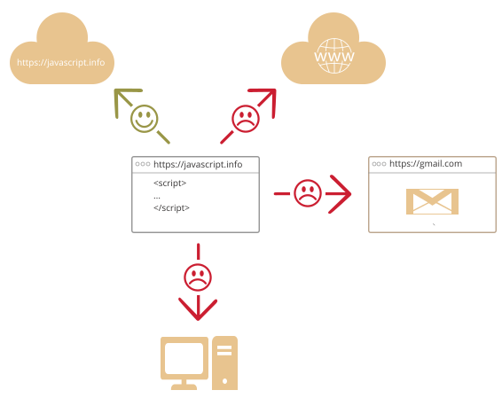

# O introducere în JavaScript

Să vedem ce e atât de special la JavaScript, ce putem realiza cu el și ce alte tehnologii se înțeleg bine cu acesta.

## Ce este JavaScript?

*JavaScript* a fost creat inițial pentru "a da viață paginilor".

În acest limbaj programele sunt numite *script-uri*(scripts). Acestea pot fi scrise direct în HTML și executate în mod automat pe măsură ce pagina se încarcă.

Script-urile sunt furnizate și executate ca și text simplu. Ele nu au nevoie de pregătire specială sau de compilare pentru a rula.

În ceea ce privește acest aspect, JavaScript este foarte diferit față de un alt limbaj cu nume asemănător, [Java](https://en.wikipedia.org/wiki/Java_(programming_language)).

```smart header="Why <u>Java</u>Script?"
Când JavaScript a fost creat, inițial avea un alt nume: "LiveScript". Dar Java era foarte popular la acel moment, așa s-a decis că poziționarea unui nou limbaj ca și "frate mai mic" al lui Java, va ajuta. 

Dar cum acesta a evoluat, JavaScript a devenit un limbaj complet independent, cu propriile specificații, numite [ECMAScript](http://en.wikipedia.org/wiki/ECMAScript), iar acum nu mai are nici o legătură cu Java.
```

În prezent, JavaScript nu doar că poate executa în browser, dar de asemenea poate executa pe server, sau chiar pe orice dispozitiv care are un program special numit [ motorul JavaScript(the JavaScript engine)](https://en.wikipedia.org/wiki/JavaScript_engine).

Browser-ul are un motor încorporat, uneori denumit "mașină virtuală JavaScript"(JavaScript virtual machine).

Diferite motoare au diferite "nume de cod", spre exemplu:

- [V8](https://en.wikipedia.org/wiki/V8_(JavaScript_engine)) -- în Chrome și Opera.
- [SpiderMonkey](https://en.wikipedia.org/wiki/SpiderMonkey) -- în Firefox.
- ...Mai există și alte nume de cod precum "Chakra" pentru IE, "JavaScriptCore", "Nitro" și "SquirrelFish" pentru Safari, etc.

Termenii de mai sus sunt bine de știut pentru că ei sunt folosiți în articole ale dezvoltatorilor de pe internet. Va trebui să-i și folosim. Spre exemplu, dacă "o caracteristică(feature) X este suportată de către V8", atunci probabil că merge și în Chrome, Opera și Edge.

```smart header="How do engines work?"

Motoarele sunt complicate. Dar bazele sunt ușoare.

<<<<<<< HEAD
1. Motorul (încorporat, dacă este un browser) citește("parsează") script-ul.
2. Apoi convertește("compilează") script-ul în limbajul mașină.
3. Apoi codul mașină rulează, destul de repede.
=======
1. The engine (embedded if it's a browser) reads ("parses") the script.
2. Then it converts ("compiles") the script to machine code.
3. And then the machine code runs, pretty fast.
>>>>>>> ff804bc19351b72bc5df7766f4b9eb8249a3cb11

Motorul aplică optimizări la fiecare stadiu al procesului. Ba chiar observă script-ul compilat cum rulează, analizează datele care trec prin el și aplică optimizări suplimentare asupra codului mașină bazate pe informațiile strânse.
```

## Ce poate JavaScript-ul din browser să facă?

<<<<<<< HEAD
JavaScript-ul modern este un limbaj de programare "sigur". Nu furnizează acces low-level la memorie sau la CPU, pentru că inițial a fost creat pentru browsere, care nu necesitau acest lucru.
=======
Modern JavaScript is a "safe" programming language. It does not provide low-level access to memory or the CPU, because it was initially created for browsers which do not require it.
>>>>>>> ff804bc19351b72bc5df7766f4b9eb8249a3cb11

Capabilitățile depind mult de mediul în se care rulează JavaScript. De exemplu, [Node.JS](https://wikipedia.org/wiki/Node.js) suportă funcții care permit JavaScript-ului să citească/scrie fișiere arbitrare, să realizeze request-uri de rețea, etc.

Javascript-ul din browser poate face orice în legătură cu manipularea paginii web, interacțiunea cu utilizatorul, și cu serverul web.

De exemplu, JavaScript din browser este capabil să:

- Adauge HTML nou în pagină, schimbe  conținutul existent, modifice stiluri.
- Reacționeze la acțiunile utilizatorului, execute la click de mouse, mișcări ale cursorului, sau apăsări de taste.
- Trimită request-uri prin rețea către servere remote(la distanță), descarce și încarce fișiere (așa-numitele tehnologii [AJAX](https://en.wikipedia.org/wiki/Ajax_(programming)) și [COMET](https://en.wikipedia.org/wiki/Comet_(programming))).
- Preia și să seteze cookie-uri, pună întrebări vizitatorului, arate mesaje.
- Să-și amintească date pe partea de client("local storage").

## Ce NU poate JavaScript-ul din browser să facă?

<<<<<<< HEAD
Abilitățile JavaScript-ului din browser sunt limitate de dragul siguranței utilizatorului. Scopul este de a preveni o pagină web malițioasă să acceseze informații private sau să corupă datele utilizatorului.
=======
JavaScript's abilities in the browser are limited to protect the user's safety. The aim is to prevent an evil webpage from accessing private information or harming the user's data.
>>>>>>> ff804bc19351b72bc5df7766f4b9eb8249a3cb11

Exemplele acestor restricții sunt:

- JavaScript-ul de pe o pagină web nu poate citi/scrie fișiere arbitrare pe hard disk, nu le poate copia sau să execute programe. Nu are acces direct la funcțiile sistemului de operare.

    Browserele moderne îi permit să lucreze cu fișiere, dar accesul este limitat și furnizat doar dacă utilizatorul realizează anumite acțiuni, cum ar fi "scăparea" unui fișier într-o fereastră de browser sau selectarea lui printr-un tag `<input>`.

<<<<<<< HEAD
    Există mijloace prin care se poate interacționa cu camera/microfonul sau alte dispozitive, dar ele necesită permisiunea explicită a utilizatorului. Așadar o pagină pe care este activat JavaScript-ul nu ar putea activa o cameră web în mod viclean, și să privească împrejurimile și să trimită informații către [NSA](https://en.wikipedia.org/wiki/National_Security_Agency).
- În general, diferite tab-uri/ferestre nu știu nimic unele despre celelalte. Câteodată acestea știu, de exemplu când o fereastră folosește JavaScript pentru a deschide cealaltă fereastră. Dar chiar și în acest caz, JavaScript nu poate accesa cealaltă fereastră dacă ambele ferestre vin de pe site-uri diferite (de la un domeniu, protocol sau port diferit).

    Acest lucru se numește "Same Origin Policy"(politica aceleiași origini). Pentru a lucra în jurul acesteia, *ambele pagini* trebuie să conțină un cod special JavaScript care să administreze schimbul de date.

    Limitarea este din nou pentru siguranța utilizatorului. O pagină de la `http://anysite.com` pe care un utilizator a deschis-o nu trebuie să poată accesa alt tab al browser-ului cu URL-ul `http://gmail.com` și să fure informații de acolo.
- JavaScript poate cu ușurință să comunice pe net către server, de unde a venit pagina curentă. Dar abilitatea sa de a primi date de la alte site-uri/domenii este infirmată. Deși posibil, acesta necesită acord explicit(exprimat prin headere HTTP) din partea serverului de la distanță. Din nou, acestea sunt limitări de securitate.



Astfel de limite nu există dacă JavaScript este folosit în afara browser-ului, de exemplu pe un server. Browserele moderne permit de asemenea instalarea plugin-urilor/extensiilor care pot cere extinderea permisiunilor.
=======
    There are ways to interact with the camera/microphone and other devices, but they require a user's explicit permission. So a JavaScript-enabled page may not sneakily enable a web-camera, observe the surroundings and send the information to the [NSA](https://en.wikipedia.org/wiki/National_Security_Agency).
- Different tabs/windows generally do not know about each other. Sometimes they do, for example when one window uses JavaScript to open the other one. But even in this case, JavaScript from one page may not access the other page if they come from different sites (from a different domain, protocol or port).

    This is called the "Same Origin Policy". To work around that, *both pages* must agree for data exchange and must contain special JavaScript code that handles it. We'll cover that in the tutorial.

    This limitation is, again, for the user's safety. A page from `http://anysite.com` which a user has opened must not be able to access another browser tab with the URL `http://gmail.com`, for example, and steal information from there.
- JavaScript can easily communicate over the net to the server where the current page came from. But its ability to receive data from other sites/domains is crippled. Though possible, it requires explicit agreement (expressed in HTTP headers) from the remote side. Once again, that's a safety limitation.


Such limitations do not exist if JavaScript is used outside of the browser, for example on a server. Modern browsers also allow plugins/extensions which may ask for extended permissions.
>>>>>>> ff804bc19351b72bc5df7766f4b9eb8249a3cb11

## Ce face JavaScript, unic?

Sunt cel puțin *trei* lucruri imporante în legătură cu JavaScript:

```compare
+ Integrare completă cu HTML/CSS.
+ Lucrurile simple sunt făcute simplu.
+ Este suportat de toate browserele majore și activat în mod implicit.
```
JavaScript este singura tehnologie browser care combină aceste trei lucruri.

Asta e ceea ce face JavaScript unic. De aceea este cea mai răspândită unealtă pentru crearea de interfețe pentru browser.

<<<<<<< HEAD
Acestea fiind spuse, JavaScript permite de asemenea crearea serverlor, aplicațiilor mobile etc.
=======
That said, JavaScript can be used to create servers, mobile applications, etc.
>>>>>>> ff804bc19351b72bc5df7766f4b9eb8249a3cb11

## Limbaje "peste" JavaScript

Sintaxa JavaScript-ului nu se potrivește cerințelor fiecăruia. Persoane diferite vor diferite feature-uri.

Acest lucru este de așteptat, pentru că proiectele și cerințele sunt diferite pentru fiecare.

<<<<<<< HEAD
Așa că, recent au apărut o pletoră de limbaje noi, care sunt *transpiled*(convertite) în JavaScript înainte ca ele să ruleze în browser.
=======
So, recently a plethora of new languages appeared, which are *transpiled* (converted) to JavaScript before they run in the browser.
>>>>>>> ff804bc19351b72bc5df7766f4b9eb8249a3cb11

Uneltele moderne fac transpilarea foarte rapidă și transparentă, permițând defapt dezvoltatorilor să codeze în alt limbaj și să auto convertească codul în cod "sub capotă"(under the hood).

Exemple de astfel de limbaje:

<<<<<<< HEAD
- [CoffeeScript](http://coffeescript.org/) este un "zahăr sintatic" pentru JavaScript. El introduce sintaxă mai scurtă, permițându-ne să scrim cod mai clar și mai precis. De obicei dezvoltatorii Ruby îl plac.
- [TypeScript](http://www.typescriptlang.org/) este concentrat pe adăugarea de "tipizare strictă de date", pentru a simplifica dezvoltarea și suportul sistemelor complexe. Este dezvoltat de Microsoft.
- [Flow](http://flow.org/) de asemeni adaugă data typing, dar într-un mod diferit. Dezvoltat de Facebook.
- [Dart](https://www.dartlang.org/) este un limbaj standalone care are propriul său motor care rulează în medii non-browser(precum aplicațiile mobile), dar deasemeni poate fi transpiled în JavaScript. Dezvoltat de Google.
- [Brython](https://brython.info/) este un transpiler Python în JavaScript care permite scrierea aplicațiilor în Python pur fără Javascript.
- [Kotlin](https://kotlinlang.org/docs/reference/js-overview.html) este un limbaj de programare modern, concis și sigur care țintește browser-ul sau Node.

Există mai multe. Desigur, chiar dacă folosim unul dintre aceste limbaje, ar trebui de asemenea să știm JavaScript, pentru a înțelege cu adevărat ce facem.
=======
- [CoffeeScript](https://coffeescript.org/) is "syntactic sugar" for JavaScript. It introduces shorter syntax, allowing us to write clearer and more precise code. Usually, Ruby devs like it.
- [TypeScript](https://www.typescriptlang.org/) is concentrated on adding "strict data typing" to simplify the development and support of complex systems. It is developed by Microsoft.
- [Flow](https://flow.org/) also adds data typing, but in a different way. Developed by Facebook.
- [Dart](https://www.dartlang.org/) is a standalone language that has its own engine that runs in non-browser environments (like mobile apps), but also can be transpiled to JavaScript. Developed by Google.
- [Brython](https://brython.info/) is a Python transpiler to JavaScript that enables the writing of applications in pure Python without JavaScript.
- [Kotlin](https://kotlinlang.org/docs/reference/js-overview.html) is a modern, concise and safe programming language that can target the browser or Node.

There are more. Of course, even if we use one of these transpiled languages, we should also know JavaScript to really understand what we're doing.
>>>>>>> ff804bc19351b72bc5df7766f4b9eb8249a3cb11

## Rezumat

- JavaScript a fost creat inițial ca limbaj doar pentru browser(browser-only), dar acum este de asemenea folosit în multe alte medii.
- La momentul actual, JavaScript deține o poziție unică ca cel mai răspândit și adoptat limbaj browser cu integrare completă cu HTML/CSS.
- Există multe limbaje care sunt "transpilate" în JavaScript și furnizează anumite caracteristici. Este recomandat să arunci o privire peste ele, în linii mari, după ce stăpânești JavaScript.
