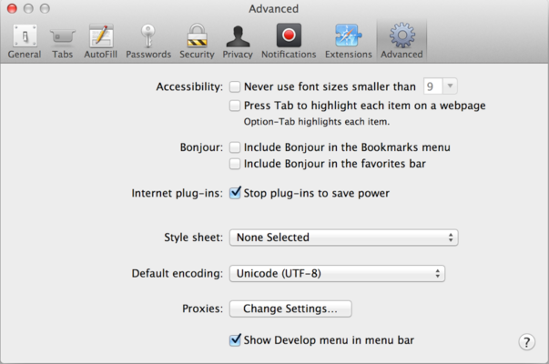

# Consola de dezvoltare

Codul este predispus erorilor. E foarte probabil că vei face erori... Ah, dar despre ce vorbesc? Sunt *absolut* sigur că vei face erori, cel puțin dacă ești ființă umană, nu [robot](https://en.wikipedia.org/wiki/Bender_(Futurama)).

Dar în browser, utilizatorii nu văd erorile în mod implicit. Așadar, dacă ceva este stricat în script, nu putem să vedem ce este stricat și nici nu putem să reparăm.

Pentru a vedea erorile și o mulțime de alte informații utile despre scripturi, în browsere au fost adăugate "unelte de dezvoltare".

Cei mai mulți dezvoltatori înclină spre Chrome sau Firefox pentru dezvoltare deoarece aceste browsere au cele mai bune unelte de dezvoltare. Alte browsere au și ele unelte de dezvoltare, unele cu facilități speciale, dar în general încearcă să ajungă din urmă Chrome și Firefox. Așadar, cei mai mulți dezvoltatori au un *browser* preferat dar folosesc alte browsere când apare o problemă specifică unui browser anume.

Uneltele de dezvoltare sunt foarte puternice; ele au multe facilități. Pentru început, vom învăța cum să le deschidem, să ne uităm la erori, să executăm comenzi JavaScript.

## Google Chrome

Deschideți pagina [bug.html](bug.html).

În codul JavaScript de pe pagină este o eroare. Este ascunsă ochiului vizitatorilor, deci hai să deschidem uneltele de dezvoltare pentru a o vedea.

Apăsați tasta `key:F12` sau, dacă folosiți un Mac, apăsați tastele `key:Cmd+Opt+J`.

Uneltele de dezvoltare se vor deschide cu tabul Console deschis implicit.

Arată similar cu:


Aspectul exact al uneltelor de dezvoltare depinde de versiunea de Chrome folosită. Se schimbă din când în când, dar trebuie să fie asemănătoare.

- Aici vedem mesajul colorat în roșu. În acest caz, scriptul conține o comandă necunoscută, "lalala".
- În partea dreaptă se află un link către sursa `bug.html:12`, cu numărul liniei pe care a apărut eroarea. 

<<<<<<< HEAD
Sub mesajul de eroare se află un simbol `>` albastru. El marchează o "linie de comandă" unde putem introduce comenzi JavaScript. Apăsați `key:Enter` ca să le rulați (`key:Shift+Enter` pentru a introduce comenzi pe mai multe linii).
=======
Below the error message, there is a blue `>` symbol. It marks a "command line" where we can type JavaScript commands. Press `key:Enter` to run them.
>>>>>>> b0464bb32c8efc2a98952e05f363f61eca1a99a2

Pentru moment putem vedea erorile și asta e suficient pentru început. Vom reveni mai târziu la uneltele de dezvoltare și vom detalia depanarea în capitolul <info:debugging-chrome>.

```smart header="Multi-line input"
Usually, when we put a line of code into the console, and then press `key:Enter`, it executes.

To insert multiple lines, press `key:Shift+Enter`. This way one can enter long fragments of JavaScript code.
```

## Firefox, Edge, și altele

Multe alte browsere folosesc tasta `key:F12` pentru a deschide uneltele de dezvoltare.

Aspectul și funcționarea lor sunt oarecum similare. Odată ce ați învățat să folosiți uneltele într-un browser (puteți începe cu Chrome), puteți face ușor trecerea la alt browser.

## Safari

Safari (browser pentru Mac, nesuportat pe Windows/Linux) e un pic diferit. Întâi trebuie să activăm meniul de dezvoltare (Develop menu).

Deschideți preferințele (Preferences) și mergeți în secțiunea de setări avansate (Advanced). În partea de jos se află un checkbox.



Acum, cu tastele `key:Cmd+Opt+C` puteți afișa sau ascunde consola. De asemenea, în meniul principal a apărut opțiunea "Develop". Are multe comenzi și opțiuni.

<<<<<<< HEAD
```smart header="Multi-line input"
În mod obișnuit, când introducem o linie de cod în consolă și apoi apăsăm `key:Enter`, codul se execută.

Pentru a introduce mai multe linii, apăsați `key:Shift+Enter`. În acest fel oricine poate insera fragmente lungi de cod JavaScript.
```

## Rezumat
=======
## Summary
>>>>>>> b0464bb32c8efc2a98952e05f363f61eca1a99a2

- Uneltele de dezvoltare ne permit să vedem erori, să executăm comenzi, să evaluăm variabile și multe altele.
- Ele pot fi deschise cu tasta `key:F12` în majoritatea browserelor, pe Windows. Chrome pentru Mac folosește `key:Cmd+Opt+J`, Safari: `key:Cmd+Opt+C` (dar trebuie întâi activat).

Acum avem mediul gata. În secțiunea următoare ne vom ocupa de JavaScript.
