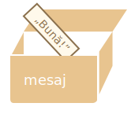
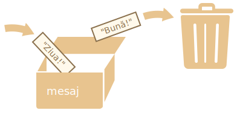

# Variables

În cea mai mare parte a timpului, o aplicație JavaScript are nevoie de informație pentru a funcționa. Două exemple sunt:
1. Un magazin online -- informația poate include bunurile vândute și produsele din coș.
2. O aplicație de mesaje -- informația poate include utilizatorii, mesajele și multe altele.

Variabilele sunt folosite pentru a stoca această informație.

## O variabilă

O [variabilă](https://ro.wikipedia.org/wiki/Variabil%C4%83) este un „spațiu de stocare denumit” pentru date. Putem folosi variabile pentru a stoca bomboane, vizitatori și alte date.

Pentru a crea o variabilă în JavaScript, folosim termenul `let`.

Codul de mai jos creează (în alte cuvinte, *declară* sau *definește*) o variabilă cu numele „mesaj”:

```js
let mesaj;
```

Acum, putem pune date în ea utilizând operatorul de atribuire `=`:

```js
let mesaj;

*!*
mesaj = 'Bună'; // stocăm șirul de caractere
*/!*
```

Șirul de caractere este acum salvat în zona de memorie asociată cu variabila. O putem accesa utilizând numele variabilei:

```js run
let mesaj;
mesaj = 'Bună!';

*!*
alert(mesaj); // afișază conținutul variabilei
*/!*
```

Pentru a fi conciși, putem combina declarația și atribuirea variabilei într-un singur rând:

```js run
let mesaj = 'Bună!'; // definește variabila și atribuie valoarea.

alert(mesaj); // Bună!
```

Putem de asemenea să declarăm mai multe variabile pe un singur rând:

```js no-beautify
let utilizator = 'Ion', ani = 25, mesaj = 'Bună';
```

Poate părea că este mai simplu, dar nu este recomandat. Pentru o lizibilitate crescute, te rugăm să folosești un singur rând per variabilă.

Varianta pe mai multe linii este puțin mai lungă, dar mai ușor de citit:

```js
let utilizator = 'Ion';
let ani = 25;
let mesaj = 'Bună';
```

Unii oameni definesc variabile multiple în acest stil pe mai multe linii:
```js no-beautify
let utilizator = 'Ion',
  ani = 25,
  mesaj = 'Bună';
```

...Sau chiar astfel, unde fiecare rând începe cu o virgulă.

```js no-beautify
let utilizator = 'Ion'
  , ani = 25
  , mesaj = 'Bună';
```

Din punct de vedere tehnic, toate variantele de mai sus fac același lucru, deci este o chestiune de estetică și de gusturi personale.


````smart header="`var` înloc de `let`"
În sripturi mai vechi, poți găsi și un alt termen: `var`, în loc de `let`:

```js
*!*var*/!* mesaj = 'Bună';
```

Termenul `var` este *aproape* identic cu `let`. Declară tot o variabilă, dar într-o manieră puțin diferită și „demodată”.

Există diferențe subtile între `let` și `var`, dar nu sunt importante pentru noi încă. Le vom acoperi în detaliu în capitolul <info:var>.
````

## O analogie din viața de zi cu zi

Putem înțelege mai ușor conceptul de „variabilă” dacă ne-o imaginăm ca pe o „cutie” pentru date, cu o etichetă unică lipită pe ea.

De exemplu, variabila `mesaj` poate fi imaginată ca fiind o cutie etichetată `„mesaj”` cu valoarea `„Bună”` în interior:



Putem pune orice valoare în cutie.

Putem de asemenea să o schimbăm de câte ori dorim:

```js run
let mesaj;

mesaj = 'Bună!';

mesaj = 'Ziua!'; // value changed

alert(mesaj);
```

Odată ce valoarea este schimbată, vechea valoare este ștearsă din variabilă:



Putem de asemenea să declarăm două variabile și să copiem date dintr-una în cealaltă.

```js run
let salut = 'Bună ziua!';

let mesaj;

*!*
// copiază 'Bună ziua' din salut în mesaj
mesaj = salut;
*/!*

// acum două variabile conțin aceeași informație
alert(salut); // Bună ziua!
alert(mesaj); // Bună ziua!
```

```smart header="Limbaje de programare funcționale"
Este interesant de știut că există limbaje de programare [funcționale](https://ro.wikipedia.org/wiki/Programare_func%C8%9Bional%C4%83), ca [Scala](https://ro.wikipedia.org/wiki/Scala_(limbaj_de_programare)) sau [Erlang](http://www.erlang.org/) care nu permit schimbarea valorii unei variabile.

În astfel de limbi, odată ce valoarea este stocată „în cutie”, rămâne acolo pentru totdeauna. Dacă dorim să stocăm altceva, limbajul ne forțează să creăm o nouă cutie (să declarăm o nouă variabilă). Nu o putem refolosi pe cea veche.

Deși poate părea puțin ciudat la început, aceste limbaje sunt foarte capabile de dezvoltare și programare serioasă. Mai mult de atât, există domenii precum calculul paralel, unde această limitare oferă anumite beneficii. Studierea unui astfel de limbaj (chiar dacă nu plănuiești să-l folosești curând) este recomandată pentru a-ți dezvolta mintea.
```

## Denumirea variabilelor [#variable-naming]

Există două limitări asupra denumirii variabilelor în JavaScript:

1. Numele trebuie să conțină doar litere, cifre sau simbolurile `$` și `_`.
2. Primul caracter nu poate fi o cifră.

Exemple de nume valide:

```js
let numeUtilizator;
let test123;
```

Atunci când numele conține mai multe cuvinte, [camelCase](https://ro.wikipedia.org/wiki/Camel_case) este folosit de obicei. Asta înseamnă că toate cuvintele sunt unite, iar fiecare cuvânt în afară de primul începe cu o majusculă: `unNumeDeUtilizatorFoarteLung`.

Interesant este că semnul dolar `$` și sublinie `„_”` pot fi folosite în nume. Ele sunt simboluri normale, ca literele, fără vreo însemnătate specială.

Aceste nume sunt valabile:

```js run untrusted
let $ = 1; // am declarat o variabilă cu numele „$”
let _ = 2; // și acum o variabilă cu numele „_”

alert($ + _); // 3
```

Exemple de nume de variabile greșite:

```js no-beautify
let 1a; // nu putem începe cu o cifră

let my-name; // cratimele „-” nu sunt permise în nume
```

```smart header="Majusculele și minusculele contează"
Variabilele cu numele `fruct` și `FruCT` sunt două variabile diferite.
```

````smart header="Literele non-latine nu sunt recomandate"
Putem folosi orice limbă, inclusiv litere chirilice sau chiar hieroglife, ca mai jos:

```js
let имя = '...';
let 我 = '...';
```

Din punct de vedere tehnic, astfel de nume sunt permise, dar există o tradiție internațională de a utiliza alfabetul latin în numele de variabile. Chiar dacă scriem un program scurt, poate să ajungă la oameni din alte țări, care ar putea să aibă nevoie să-l citească.
````

````warn header="Denumiri rezervate"
Există o [listă de denumiri rezervate](https://developer.mozilla.org/en-US/docs/Web/JavaScript/Reference/Lexical_grammar#Keywords), care nu pot fi utilizate pentru denumiri de variabile pentru că sunt folosite de limbajul de programare însuși.

De exemplu: `let`, `class`, `return`, și `function` sunt rezervate.

Codul de mai jos rezultă într-o eroare de sintaxă:

```js run no-beautify
let let = 5; // nu putem denumi o variabilă „let”, eroare!
let return = 5; // nu o putem numi nici „return”, eroare!
```
````

````warn header="Atribuirea unei variabile fără `use strict`"

În mod normal, trebuie să definim o variabilă înainte de a o utiliza. Dar mai demult, era tehnic posibil să creăm o variabilă printr-o simplă atribuire a valorii fără a folosi `let`. Asta încă funcționează acum dacă nu folosim `use strict` în program, pentru a păstra compatibilitatea cu programele vechi.

```js run no-strict
// notă: nu folosim „use strict” în acest program

num = 5; // variabila „num” este creată acum dacă nu exista deja

alert(num); // 5
```

Aceasta este o practică nerecomandată și ar provoca o eroare în modul strict:

```js
"use strict";

*!*
num = 5; // eroare: num nu este definit
*/!*
```
````

## Constante

Pentru a declara o variabilă constantă (care nu se schimbă), folosim `const` în loc de `let`:

```js
const ziuaMea = '18.04.1982';
```

Variabilele declarate folosind `const` se numesc „constante”. Ele nu pot fi schimbate. O încercare de a le schimba rezultă într-o eroare:

```js run
const ziuaMea = '18.04.1982';

ziuaMea = '01.01.2001'; // eroare, nu putem reatribui constanta!
```

Când un programator este sigur că o variabilă nu se va schimba niciodată, o pot declara cu `const` pentru a asigura și a comunica acest lucru tuturor.


### Constante majuscule

Există o practică răspândită de a folosi constante ca alternative la valori greu de memorat care sunt cunoscute dinaintea executării programului.

Aceste constante sunt denumite folosind majuscule și sublineri.

De exemplu, să creăm constante pentru culori în formatul „web” (hexadecimal):

```js run
const CULOAREA_ROȘU = "#F00";
const CULOAREA_VERDE = "#0F0";
const CULOAREA_ALBASTRU = "#00F";
const CULOAREA_ORANJ = "#FF7F00";

// ...când trebuie să alegem o culoare
let culoare = CULOAREA_ORANJ;
alert(color); // #FF7F00
```

Beneficii:

- `CULOAREA_ORANJ` este mult mai ușor de memorat decât `"#FF7F00"`.
- Este mult mai ușor să scrii greșit `"#FF7F00"` decât `CULOAREA_ORANJ`.
- Când un om citește codul, `CULOAREA_ORANJ` are mai mult sens decât `#FF7F00`.

Când ar trebui să folosim majuscule pentru o constantă și când ar trebui să o denumim normal? Să clarificăm asta.

Fiind o „constantă” înseamnă că valoarea unei variabile nu se schimbă niciodată. Dar există constante care sunt cunoscute dinaintea execuției (precum valorarea hexadecimală pentru roșu) și există constante care sunt *calculate* în timpul rulării, al executării programului, dar nu se schimbă după atribuirea inițială.

De exemplu:
```js
const timpDeÎncărcare = /* cât îi ia unei pagini web să se încarce */;
```

Valoarea lui `timpDeÎncărcare` nu este cunoscută dinaintea încărcării pagini, deci este denumită normal. Dar tot este o constantă deoarece nu se modifică după atribuire.

În alte cuvinte, constantele majuscule sunt folosite ca alternative pentru valori nealterabile.

## Să denumim variabilele cum trebuie

Că tot vorbim despre variabile, mai este un lucru extrem de important.

Numele unei variabile trebuie să aibă un scop clar și să descrie datele stocate în aceasta.

Denumirea variabilelor este una dintre cele mai importante și complexe abilități în programare. O scurtă privire la numele variabilelor îți poate arăta dacă codul a fost scris de un dezvoltator începător sau de unul experimentat.

Într-un proiect real, majoritatea timpului este petrecut modificând și extinzând codul existent decât creând ceva complet nou și separat. Când ne întoarcem la o bucată de cod după mult timp în care am făcut altceva, este mai ușor să găsim informații dacă acestea sunt etichetate bine. Sau, în alte cuvinte, dacă variabilele sunt denumite cum trebuie.

Te rugăm să petreci puțin timp gândindu-te la numele potrivit pentru o variabilă înainte de a o declara. Asta te va ajuta foarte mult pe viitor.

Câteva reguli generale sunt:

- Folosește nume lizibile precum `numeDeUtilizator` sau `coșDeCumpărături`.
- Nu folosi abrevieri sau nume scurte precum `a`, `b` sau `c`, în afară de cazul în care chiar știi ce faci.
- Folosește nume descriptive și concise. Exemple de nume nepotrivite sunt `data` și `valoare`. Astfel de nume nu îți spun nimic. Le poți folosi totuși dacă contextul codului face evidentă datele sau valoarea la care se referă variabila.
- Cazi de acord la niște termeni pe care să-i folosești peste tot. Dacă vizitatorul unui site se numește „utilizator”, atunci nume de variabile pot fi „utilizatorCurent” sau „utilizatorNou”, însă nu și „vizitatorCurent” sau „persoanăNouă”.

Sună simplu? Chiar este, dar creare de nume de variabilă descriptive și concise în practică nu este așa. Încearcă și tu.

```smart header="Refolosește sau crează?"
Ultima notă. Există unii programatori leneși care, în loc de a declara variabile noi, tind să refolosească variabile existente.

Rezultatul este că variabilele lor sunt ca niște cutii în care oamenii aruncă diverse lucruri fără a le schimba eticheta. Ce este în cutie acum? Cine poate ști? Trebuie să ne uităm și să verificăm.

Astfel de programatori economisesc puțin timp prin nedeclararea de variabile noi, dar pierd de zece ori mai mult când ajung la faza de depanare a codului.

O variabilă în plus este bună, nu rea.

Minificatoarele din JavaScriptul modern și navigatoarele optimizează codul suficient de mult, deci nu va crea probleme de performanță. Folosirea de variabile diferite pentru valori diferite poate chiar să ajute motorul să-ți optimizeze programul.
```

## Rezumat

Putem declara variabile care să stocheze informații cu termenii `var`, `let`, sau `const`.

- `let` -- este o declarație de variabilă modernă
- `var` -- este o declarație de variabilă învechită. În mod normal nu o folosim deloc, dar vom acoperi diferențele subtile dintre ea și `let` în capitolul <info:var>, în caz că ai nevoie de ele.
- `const` -- ca `let`, dar valoarea variabilei nu poate fi schimbată.

Variabilele ar trebui denumite într-un fel care ne permite să înțelegem cu ușurință ce este înăuntrul lor.
