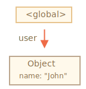
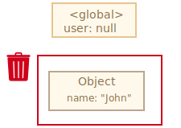
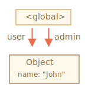
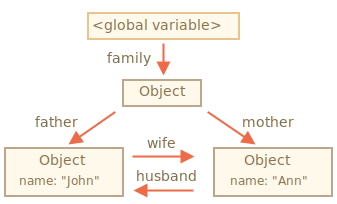
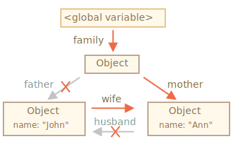
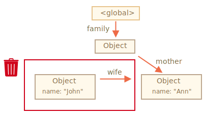
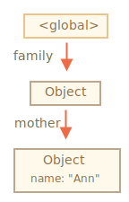
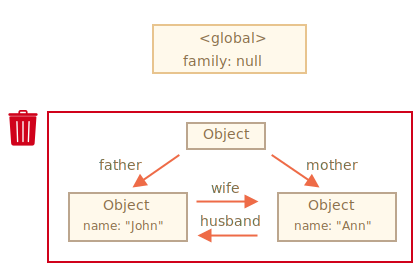
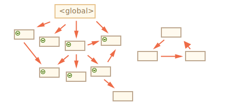

# Colectarea reziduurilor

Gestionarea memoriei în JavaScript este realizată automat și invizibil pentru noi. Creăm primitive, obiecte, funcții... Toate acestea ocupă spațiu în memorie.

Ce se întâmplă când nu mai este nevoie de ceva? Cum îl descoperă și îl curăță motorul limbajului Javascript?

## Accesibilitatea

Conceptul de bază al gestionării memoriei în JavaScript este *accesibilitatea*.

Simplu spus, valorile "accesibile" sunt acelea care sunt abordabile sau folosibile în vreun fel. Ele sunt garantate a fi salvate în memorie.

1. Există un set de bază de valori intrinseci accesibile, care nu pot fi șterse, din motive evidente.

    De exemplu:

    - Variabile locale și parametri ai funcției curente.
    - Variabile și parametri ai altor funcții din lanțul curent de apeluri imbricate.
    - Variabile globale.
    - (mai sunt și altele, cele interne, de asemenea)

    Aceste valori se numesc *rădăcini*.

2. Orice altă valoare este considerată accesibilă dacă este accesibilă dintr-o rădăcină printr-o referință sau printr-un lanț de referințe.

<<<<<<< HEAD:1-js/04-object-basics/02-garbage-collection/article.md
    De exemplu, dacă există un obiect într-o variabilă locală și acel obiect are o proprietate care face referire la alt obiect, acel obiect este considerat accesibil. Iar cele la care face referire sunt, de asemenea, accesibile. Urmează exemple detaliate.
=======
    For instance, if there's an object in a global variable, and that object has a property referencing another object, that object is considered reachable. And those that it references are also reachable. Detailed examples to follow.
>>>>>>> f489145731a45df6e369a3c063e52250f3f0061d:1-js/04-object-basics/03-garbage-collection/article.md

În motorul limbajului Javascript există un proces de fundal care se numește [garbage collector](https://en.wikipedia.org/wiki/Garbage_collection_(computer_science)). El monitorizează toate obiectele și le șterge pe cele care au devenit inaccesibile.

## Un exemplu simplu

Iată cel mai simplu exemplu:

```js
// user are o referință către obiect
let user = {
  name: "John"
};
```



Aici săgeata desemnează o referință a obiectului. Variabila globală `"user"` face referire la obiectul `{name: "John"}` (îl vom numi John pentru simplitate). Proprietatea `"name"` a lui John stochează o primitivă, astfel încât este desenat în interiorul obiectului.

Dacă valoarea `user`-ului este rescrisă, referința este pierdută:

```js
user = null;
```



Acum John devine inaccesibil. Nu există nicio modalitate pentru a-l accesa, nicio referință la el. Garbage collector va elimina datele și va elibera memoria.

## Două referințe

Acum să ne imaginăm că am copiat referința de la `user` la `admin`:

```js
// user are o referință către obiect
let user = {
  name: "John"
};

*!*
let admin = user;
*/!*
```



Acum dacă procedăm la fel:
```js
user = null;
```

...Atunci obiectul este încă accesibil prin intermediul variabilei globale `admin`, deci este în memorie. Dacă rescriem și `admin`, atunci poate fi indepărtat.

## Obiecte interconectate

Acum un exemplu mai complex. Familia:

```js
function marry(man, woman) {
  woman.husband = man;
  man.wife = woman;

  return {
    father: man,
    mother: woman
  }
}

let family = marry({
  name: "John"
}, {
  name: "Ann"
});
```

Funcția `marry` "căsătorește" două obiecte oferindu-le reciproc referințe și returnează un obiect nou care le conține pe amândouă.

Structura memoriei rezultate:



Începând de acum, toate obiectele sunt accesibile.

Acum să eliminăm două referințe:

```js
delete family.father;
delete family.mother.husband;
```



Nu este suficient să ștergem doar una dintre aceste două referințe, pentru că toate obiectele ar fi încă accesibile.

Însă dacă le ștergem pe amândouă, putem observa că John nu mai are nicio referință de intrare:



Referințele de ieșire nu contează. Doar cele de intrare pot face un obiect accesibil. Așadar, John este acum inaccesibil și va fi eliminat din memorie cu toate datele asociate, care vor deveni, de asemenea, inaccesibile.

După colectarea reziduurilor:



## Insula inaccesibilă

Este posibil ca toată insula cu obiectele interconectate să devină inaccesibilă și să fie eliminată din memorie.

Obiectul sursă este la fel ca mai sus. Apoi:

```js
family = null;
```

Imaginea din memorie devine:



Acest exemplu demonstrează cât de important este conceptul de accesibilitate.

Este evident că John și Ann sunt încă legate, amăndouă au referințe de intrare. Dar nu este suficient.

Fostul obiect `"family"` a fost deconectat de la rădăcină, nu mai există nicio referință la el, deci întreaga insulă devine iaccesibilă și va fi eliminată.

## Algoritmi interni

Algoritmul de bază de colectare a reziduurilor este denumit "mark-and-sweep" (în traducere literală "marchează-și-mătură").

Următorii pași ai "colectării reziduurilor" sunt efectuați regulat:

<<<<<<< HEAD:1-js/04-object-basics/02-garbage-collection/article.md
- "Garbage collector" ia rădăcinile și le "marchează" (le memorează).
- Apoi vizitează toate referințele dinspre ele.
- Apoi parcurge obiectele marcate și însemnează referințele *lor*. Toate obiectele vizitate sunt memorate pentru a nu vizita același obiect de două ori în viitor.
- ...Și așa mai departe până când nu există referințe nevizitate (accesibil din rădăcini).
- Toate obiectele, cu excepția celor marcate, sunt eliminate.
=======
- The garbage collector takes roots and "marks" (remembers) them.
- Then it visits and "marks" all references from them.
- Then it visits marked objects and marks *their* references. All visited objects are remembered, so as not to visit the same object twice in the future.
- ...And so on until every reachable (from the roots) references are visited.
- All objects except marked ones are removed.
>>>>>>> f489145731a45df6e369a3c063e52250f3f0061d:1-js/04-object-basics/03-garbage-collection/article.md

De exemplu, să presupunem că structura obiectului nostru arată așa:


Putem vedea foarte clar o "insulă inaccesibilă" în partea dreaptă. Acum să vedem cum se ocupă colectorul de reziduuri "mark-and-sweep" de aceasta.

Primul pas marchează rădăcinile:


Apoi sunt marcate referințele lor:



...Și referințele acestora, atât cât este posibil:


Acum, obiectele care nu au putut fi vizitate pe parcursul procesului sunt considerate inaccesibile și vor fi eliminate:


<<<<<<< HEAD:1-js/04-object-basics/02-garbage-collection/article.md
Acesta este conceptul de funcționare a colectării reziduurilor.

Motoarele limbajului JavaScript aplică numeroase optimizări pentru a-l face să ruleze mai rapid și să nu afecteze execuția.
=======
We can also imagine the process as spilling a huge bucket of paint from the roots, that flows through all references and marks all reachable objects. The unmarked ones are then removed.

That's the concept of how garbage collection works. JavaScript engines apply many optimizations to make it run faster and not affect the execution.
>>>>>>> f489145731a45df6e369a3c063e52250f3f0061d:1-js/04-object-basics/03-garbage-collection/article.md

Câteva dintre optimizări:

- **Colectare generațională** -- obiectele sunt împărțite în două seturi: "cele noi" și "cele vechi". Multe obiecte apar, își fac treaba și mor repede, pot fi curățate agresiv. Cele care supraviețuiesc suficient de mult devin "vechi" și sunt examinate mai rar.
- **Colectare incrementală** -- dacă există multe obiecte și încercăm să parcurgem simultan întregul set obiect, poate dura mai mult și poate introduce întârzieri vizibile în execuție. Astfel încât, motorul încearcă să împartă în bucăți colectarea reziduurilor. Apoi bucățile sunt executate separat, una câte una. Asta necesită o mai bună contabilitate între ele pentru a urmări modificările, dar avem mai multe întârzieri micuțe în loc de una mare.
- **Colectare în timp-inactiv** -- colectorul de reziduuri încearcă să ruleze numai în timp ce procesorul este inactiv, pentru a reduce posibilul efect asupra execuției.

<<<<<<< HEAD:1-js/04-object-basics/02-garbage-collection/article.md
Există și alte optimzări și modele ale algoritmilor de colectare a reziduurilor. Oricât de mult mi-ar plăcea să le descriu aici. trebuie să mă abțin, întrucât diferite motoare implementează ajustări și tehnici diferite. Și, ceea ce este și mai important, lucrurile se schimbă pe măsură ce motoarele se dezvoltă, deci aprofundarea "în avans", fără o nevoie reală, probabil că nu merită acest lucru. Cu excepția cazului în care, bineînțeles, este o chestiune de interes pur, atunci vor fi câteva link-uri pentru voi mai jos.
=======
There exist other optimizations and flavours of garbage collection algorithms. As much as I'd like to describe them here, I have to hold off, because different engines implement different tweaks and techniques. And, what's even more important, things change as engines develop, so studying deeper "in advance", without a real need is probably not worth that. Unless, of course, it is a matter of pure interest, then there will be some links for you below.
>>>>>>> f489145731a45df6e369a3c063e52250f3f0061d:1-js/04-object-basics/03-garbage-collection/article.md

## Rezumat

Lucrurile principale de știut:

- Colectarea reziduurilor se face automat. Nu o putem forța sau preveni.
- Obiectele sunt menținute în memorie atât timp cât sunt accesibile.
- A fi referențiat nu este același lucru cu a fi accesibil (dintr-o rădăcină): un pachet de obiecte interconectate poate deveni inaccesibil în ansamblu.

Motoarele moderne implementează algoritmi avansați de colectare a reziduurilor.

O carte generală "The Garbage Collection Handbook: The Art of Automatic Memory Management" (R. Jones et al) acoperă câteva dintre ele.

Dacă sunteți familiari cu programarea low-level, informații detaliate despre V8 garbage collector se află în articolul [A tour of V8: Garbage Collection](http://jayconrod.com/posts/55/a-tour-of-v8-garbage-collection).

[V8 blog](https://v8.dev/) publică, deasemenea, articole din timp în timp despre schimbările din gestionarea memoriei. Desigur, pentru a învăța colectarea reziduurilor, ar fi bine să vă pregătiți învățând despre structurile interne ale V8-ului în general și să citiți blogul lui [Vyacheslav Egorov](http://mrale.ph) care a lucrat ca unul dintre inginerii V8-ului. Spun: "V8", deoarece este cel mai bine acoperit cu articole din internet. Pentru alte motoare, multe abordări sunt similare, dar colectarea reziduurilor diferă în multe aspecte.

Cunoașterea în profunzime a motoarelor este folositoare atunci când aveți nevoie de optimizări low-level. Ar fi înțelept să planificați acest lucru ca pas următor după ce vă familiarizați cu limbajul.
