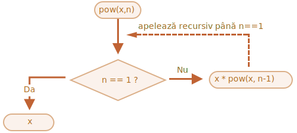

# Recursion și stack

Să ne întoarcem la funcții și să le studiem mai în profunzime.

Primul nostru subiect va fi *recursiunea*.

Dacă nu sunteți noi în programare, atunci probabil că vă este familiar și puteți sări peste acest capitol.

Recursiunea este un tipar de programare care este util în situațiile în care o sarcină poate fi împărțită în mod natural în mai multe sarcini de același tip, dar mai simple. Sau atunci când o sarcină poate fi simplificată într-o acțiune ușoară plus o variantă mai simplă a aceleiași sarcini. Sau, după cum vom vedea în curând, pentru a trata anumite structuri de date.

Atunci când o funcție îndeplinește o sarcină, în acest proces poate apela multe alte funcții. Un caz parțial este atunci când o funcție se apelează pe sine *însăși*. Acest lucru se numește *recursiune*.

## Două moduri de a gândi

Pentru a începe cu ceva simplu -- să scriem o funcție `pow(x, n)` care ridică `x` la o putere naturală a lui `n`. Cu alte cuvinte, înmulțește `x` cu el însuși de `n` ori.

```js
pow(2, 2) = 4
pow(2, 3) = 8
pow(2, 4) = 16
```

Există două moduri de a o implementa.

1. Gândire iterativă: `for` loop:

    ```js run
    function pow(x, n) {
      let result = 1;

      // înmulțește rezultatul cu x de n ori în loop
      for (let i = 0; i < n; i++) {
        result *= x;
      }

      return result;
    }

    alert( pow(2, 3) ); // 8
    ```

2. Gândire recursivă: simplificând sarcină și apelânduse pe sine:

    ```js run
    function pow(x, n) {
      if (n == 1) {
        return x;
      } else {
        return x * pow(x, n - 1);
      }
    }

    alert( pow(2, 3) ); // 8
    ```

Vă rugăm să observați că varianta recursivă este fundamental diferită.

Atunci când `pow(x, n)` este apelată, execuția se împarte în două ramuri:

```js
              if n==1  = x
             /
pow(x, n) =
             \
              else     = x * pow(x, n - 1)
```

1. Dacă `n == 1`, atunci totul este trivial. Se numește *baza* recursiunii, pentru că produce imediat rezultatul cel evident: `pow(x, 1)` egal cu `x`.
2. În caz contrar, putem reprezenta `pow(x, n)` ca și `x * pow(x, n - 1)`. În matematică, am putea scrie <code>x<sup>n</sup> = x * x<sup>n-1</sup></code>. Acesta se numește *un pas recursiv*: transformăm sarcina într-o acțiune mai simplă (multiplicare cu `x`) și un apel mai simplu al aceleiași sarcini (`pow` cu `n` mai mic). Următorii pași o simplifică mai mult și mai mult până când `n` ajunge la `1`.

Putem de asemenea spune că `pow` *se apelează recursiv pe sine* până când `n == 1`.




De exemplu, pentru a calcula `pow(2, 4)`, varianta recursivă face acești pași:

1. `pow(2, 4) = 2 * pow(2, 3)`
2. `pow(2, 3) = 2 * pow(2, 2)`
3. `pow(2, 2) = 2 * pow(2, 1)`
4. `pow(2, 1) = 2`

Așadar, recursivitatea reduce un apel de funcție la unul mai simplu, și apoi -- la unul și mai simplu, și așa mai departe, până când rezultatul devine evident.

````smart header="Recursiunea este de obicei mai scurtă"
O soluție recursivă este de obicei mai scurtă decât una iterativă.

Aici putem rescrie același lucru folosind operatorul condițional `?` în loc de `if` pentru a face `pow(x, n)` mai consic și totuși foarte ușor de citit:

```js run
function pow(x, n) {
  return (n == 1) ? x : (x * pow(x, n - 1));
}
```
````

Numărul maxim de apeluri nested (inclusiv primul apel) se numește *profunzime de recursiune*. În cazul nostru, acesta va fi exact `n`.

Profunzimea maximă de recursivitate este limitată de motorul JavaScript. Ne putem baza pe faptul că este 10000, unele motoare permit mai mult, dar 100000 este probabil în afara limitei pentru majoritatea acestora. Există optimizări automate care ajută la atenuarea acestui aspect ("tail calls optimizations"), dar acestea nu sunt încă acceptate peste tot și funcționează doar în cazuri simple.

Acest lucru limitează aplicarea recursivității, dar aceasta rămâne totuși foarte largă. Există multe sarcini în care modul recursiv de gândire oferă un cod mai simplu, mai ușor de întreținut.

## Execution context și stack

Acum să examinăm modul în care funcționează apelurile recursive. Pentru aceasta ne vom uita sub capota funcțiilor.

Informațiile despre procesul de execuție a unei funcții în curs de execuție sunt stocate în *execution context* al acesteia.

[Execution context](https://tc39.github.io/ecma262/#sec-execution-contexts) este o structură internă de date care conține detalii despre execuția unei funcții: unde se află acum fluxul de control, variabilele curente, valoarea lui `this` (nu o folosim aici) și alte câteva detalii interne.

Un apel de funcție are asociat exact un context de execuție.

Atunci când o funcție face un apel nested, se întâmplă următoarele:

- Funcția curentă este pusă pe pauză.
- Contextul de execuție asociat acesteia este reținut într-o structură de date specială numită *execution context stack*.
- Se execută apelul nested.
- După ce se termină, vechiul context de execuție este regăsit din stack, iar funcția exterioară este reluată de unde s-a oprit.

Să vedem ce se întâmplă în timpul apelului `pow(2, 3)`.

### pow(2, 3)

La începutul apelului `pow(2, 3)` contextul de execuție va stoca variabilele: `x = 2, n = 3`, fluxul de execuție se află la linia `1` a funcției.

Îl putem schița precum:

<ul class="function-execution-context-list">
  <li>
    <span class="function-execution-context">Context: { x: 2, n: 3, la linia 1 }</span>
    <span class="function-execution-context-call">pow(2, 3)</span>
  </li>
</ul>

Asta este când funcția începe să se execute. Condiția `n == 1` este falsy, așa că fluxul continuă în a doua ramură a lui `if`:

```js run
function pow(x, n) {
  if (n == 1) {
    return x;
  } else {
*!*
    return x * pow(x, n - 1);
*/!*
  }
}

alert( pow(2, 3) );
```


Variabilele sunt aceleași, dar linia se schimbă, deci contextul este acum:

<ul class="function-execution-context-list">
  <li>
    <span class="function-execution-context">Context: { x: 2, n: 3, la linia 5 }</span>
    <span class="function-execution-context-call">pow(2, 3)</span>
  </li>
</ul>

Pentru a calcula `x * pow(x, n - 1)`, trebuie să facem un subapel la `pow` cu noi argumente `pow(2, 2)`.

### pow(2, 2)

Pentru a efectua un apel nested, JavaScript își amintește contextul de execuție curent în *execution context stack*.

Aici apelăm aceeași funcție `pow`, dar acest lucru nu contează absolut deloc. Procesul este același pentru toate funcțiile:

1. Contextul curent este "reținut" deasupra stack-ului.
2. Noul context este creat pentru subapelare.
3. Când subapelul este terminat -- contextul anterior este săltat din stack, iar execuția sa continuă.

Acesta este context stack când am intrat în subapelul `pow(2, 2)`:

<ul class="function-execution-context-list">
  <li>
    <span class="function-execution-context">Context: { x: 2, n: 2, la linia 1 }</span>
    <span class="function-execution-context-call">pow(2, 2)</span>
  </li>
  <li>
    <span class="function-execution-context">Context: { x: 2, n: 3, la linia 5 }</span>
    <span class="function-execution-context-call">pow(2, 3)</span>
  </li>
</ul>

Noul context de execuție curent este în partea de sus (cu caractere îngroșate), iar contextele memorate anterior sunt mai jos.

Când terminăm subapelul -- este ușor să reluăm contextul anterior, deoarece acesta păstrează atât variabilele cât și locul exact al codului în care s-a oprit.

```smart
Aici în imagine folosim cuvântul "linie", deoarece în exemplul nostru există un singur subapel în linie, dar în general o singură linie de cod poate conține mai multe subapelări, cum ar fi `pow(...) + pow(...) + somethingElse(…)`.

Deci ar fi mai precis să spunem că execuția se reia "imediat după subapelare".
```

### pow(2, 1)

The process repeats: a new subcall is made at line `5`, now with arguments `x=2`, `n=1`.

A new execution context is created, the previous one is pushed on top of the stack:

<ul class="function-execution-context-list">
  <li>
    <span class="function-execution-context">Context: { x: 2, n: 1, at line 1 }</span>
    <span class="function-execution-context-call">pow(2, 1)</span>
  </li>
  <li>
    <span class="function-execution-context">Context: { x: 2, n: 2, at line 5 }</span>
    <span class="function-execution-context-call">pow(2, 2)</span>
  </li>
  <li>
    <span class="function-execution-context">Context: { x: 2, n: 3, at line 5 }</span>
    <span class="function-execution-context-call">pow(2, 3)</span>
  </li>
</ul>

There are 2 old contexts now and 1 currently running for `pow(2, 1)`.

### The exit

During the execution of `pow(2, 1)`, unlike before, the condition `n == 1` is truthy, so the first branch of `if` works:

```js
function pow(x, n) {
  if (n == 1) {
*!*
    return x;
*/!*
  } else {
    return x * pow(x, n - 1);
  }
}
```

There are no more nested calls, so the function finishes, returning `2`.

As the function finishes, its execution context is not needed anymore, so it's removed from the memory. The previous one is restored off the top of the stack:


<ul class="function-execution-context-list">
  <li>
    <span class="function-execution-context">Context: { x: 2, n: 2, at line 5 }</span>
    <span class="function-execution-context-call">pow(2, 2)</span>
  </li>
  <li>
    <span class="function-execution-context">Context: { x: 2, n: 3, at line 5 }</span>
    <span class="function-execution-context-call">pow(2, 3)</span>
  </li>
</ul>

The execution of `pow(2, 2)` is resumed. It has the result of the subcall `pow(2, 1)`, so it also can finish the evaluation of `x * pow(x, n - 1)`, returning `4`.

Then the previous context is restored:

<ul class="function-execution-context-list">
  <li>
    <span class="function-execution-context">Context: { x: 2, n: 3, at line 5 }</span>
    <span class="function-execution-context-call">pow(2, 3)</span>
  </li>
</ul>

When it finishes, we have a result of `pow(2, 3) = 8`.

The recursion depth in this case was: **3**.

As we can see from the illustrations above, recursion depth equals the maximal number of context in the stack.

Note the memory requirements. Contexts take memory. In our case, raising to the power of `n` actually requires the memory for `n` contexts, for all lower values of `n`.

A loop-based algorithm is more memory-saving:

```js
function pow(x, n) {
  let result = 1;

  for (let i = 0; i < n; i++) {
    result *= x;
  }

  return result;
}
```

The iterative `pow` uses a single context changing `i` and `result` in the process. Its memory requirements are small, fixed and do not depend on `n`.

**Any recursion can be rewritten as a loop. The loop variant usually can be made more effective.**

...But sometimes the rewrite is non-trivial, especially when a function uses different recursive subcalls depending on conditions and merges their results or when the branching is more intricate. And the optimization may be unneeded and totally not worth the efforts.

Recursion can give a shorter code, easier to understand and support. Optimizations are not required in every place, mostly we need a good code, that's why it's used.

## Recursive traversals

Another great application of the recursion is a recursive traversal.

Imagine, we have a company. The staff structure can be presented as an object:

```js
let company = {
  sales: [{
    name: 'John',
    salary: 1000
  }, {
    name: 'Alice',
    salary: 1600
  }],

  development: {
    sites: [{
      name: 'Peter',
      salary: 2000
    }, {
      name: 'Alex',
      salary: 1800
    }],

    internals: [{
      name: 'Jack',
      salary: 1300
    }]
  }
};
```

In other words, a company has departments.

- A department may have an array of staff. For instance, `sales` department has 2 employees: John and Alice.
- Or a department may split into subdepartments, like `development` has two branches: `sites` and `internals`. Each of them has their own staff.
- It is also possible that when a subdepartment grows, it divides into subsubdepartments (or teams).

    For instance, the `sites` department in the future may be split into teams for `siteA` and `siteB`. And they, potentially, can split even more. That's not on the picture, just something to have in mind.

Now let's say we want a function to get the sum of all salaries. How can we do that?

An iterative approach is not easy, because the structure is not simple. The first idea may be to make a `for` loop over `company` with nested subloop over 1st level departments. But then we need more nested subloops to iterate over the staff in 2nd level departments like `sites`... And then another subloop inside those for 3rd level departments that might appear in the future? If we put 3-4 nested subloops in the code to traverse a single object, it becomes rather ugly.

Let's try recursion.

As we can see, when our function gets a department to sum, there are two possible cases:

1. Either it's a "simple" department with an *array* of people -- then we can sum the salaries in a simple loop.
2. Or it's *an object* with `N` subdepartments -- then we can make `N` recursive calls to get the sum for each of the subdeps and combine the results.

The 1st case is the base of recursion, the trivial case, when we get an array.

The 2nd case when we get an object is the recursive step. A complex task is split into subtasks for smaller departments. They may in turn split again, but sooner or later the split will finish at (1).

The algorithm is probably even easier to read from the code:


```js run
let company = { // the same object, compressed for brevity
  sales: [{name: 'John', salary: 1000}, {name: 'Alice', salary: 1600 }],
  development: {
    sites: [{name: 'Peter', salary: 2000}, {name: 'Alex', salary: 1800 }],
    internals: [{name: 'Jack', salary: 1300}]
  }
};

// The function to do the job
*!*
function sumSalaries(department) {
  if (Array.isArray(department)) { // case (1)
    return department.reduce((prev, current) => prev + current.salary, 0); // sum the array
  } else { // case (2)
    let sum = 0;
    for (let subdep of Object.values(department)) {
      sum += sumSalaries(subdep); // recursively call for subdepartments, sum the results
    }
    return sum;
  }
}
*/!*

alert(sumSalaries(company)); // 7700
```

The code is short and easy to understand (hopefully?). That's the power of recursion. It also works for any level of subdepartment nesting.

Here's the diagram of calls:


We can easily see the principle: for an object `{...}` subcalls are made, while arrays `[...]` are the "leaves" of the recursion tree, they give immediate result.

Note that the code uses smart features that we've covered before:

- Method `arr.reduce` explained in the chapter <info:array-methods> to get the sum of the array.
- Loop `for(val of Object.values(obj))` to iterate over object values: `Object.values` returns an array of them.


## Recursive structures

A recursive (recursively-defined) data structure is a structure that replicates itself in parts.

We've just seen it in the example of a company structure above.

A company *department* is:
- Either an array of people.
- Or an object with *departments*.

For web-developers there are much better-known examples: HTML and XML documents.

In the HTML document, an *HTML-tag* may contain a list of:
- Text pieces.
- HTML-comments.
- Other *HTML-tags* (that in turn may contain text pieces/comments or other tags etc).

That's once again a recursive definition.

For better understanding, we'll cover one more recursive structure named "Linked list" that might be a better alternative for arrays in some cases.

### Linked list

Imagine, we want to store an ordered list of objects.

The natural choice would be an array:

```js
let arr = [obj1, obj2, obj3];
```

...But there's a problem with arrays. The "delete element" and "insert element" operations are expensive. For instance, `arr.unshift(obj)` operation has to renumber all elements to make room for a new `obj`, and if the array is big, it takes time. Same with `arr.shift()`.

The only structural modifications that do not require mass-renumbering are those that operate with the end of array: `arr.push/pop`. So an array can be quite slow for big queues, when we have to work with the beginning.

Alternatively, if we really need fast insertion/deletion, we can choose another data structure called a [linked list](https://en.wikipedia.org/wiki/Linked_list).

The *linked list element* is recursively defined as an object with:
- `value`.
- `next` property referencing the next *linked list element* or `null` if that's the end.

For instance:

```js
let list = {
  value: 1,
  next: {
    value: 2,
    next: {
      value: 3,
      next: {
        value: 4,
        next: null
      }
    }
  }
};
```

Graphical representation of the list:


An alternative code for creation:

```js no-beautify
let list = { value: 1 };
list.next = { value: 2 };
list.next.next = { value: 3 };
list.next.next.next = { value: 4 };
list.next.next.next.next = null;
```

Here we can even more clearly see that there are multiple objects, each one has the `value` and `next` pointing to the neighbour. The `list` variable is the first object in the chain, so following `next` pointers from it we can reach any element.

The list can be easily split into multiple parts and later joined back:

```js
let secondList = list.next.next;
list.next.next = null;
```


To join:

```js
list.next.next = secondList;
```

And surely we can insert or remove items in any place.

For instance, to prepend a new value, we need to update the head of the list:

```js
let list = { value: 1 };
list.next = { value: 2 };
list.next.next = { value: 3 };
list.next.next.next = { value: 4 };

*!*
// prepend the new value to the list
list = { value: "new item", next: list };
*/!*
```


To remove a value from the middle, change `next` of the previous one:

```js
list.next = list.next.next;
```


We made `list.next` jump over `1` to value `2`. The value `1` is now excluded from the chain. If it's not stored anywhere else, it will be automatically removed from the memory.

Unlike arrays, there's no mass-renumbering, we can easily rearrange elements.

Naturally, lists are not always better than arrays. Otherwise everyone would use only lists.

The main drawback is that we can't easily access an element by its number. In an array that's easy: `arr[n]` is a direct reference. But in the list we need to start from the first item and go `next` `N` times to get the Nth element.

...But we don't always need such operations. For instance, when we need a queue or even a [deque](https://en.wikipedia.org/wiki/Double-ended_queue) -- the ordered structure that must allow very fast adding/removing elements from both ends, but access to its middle is not needed.

Lists can be enhanced:
- We can add property `prev` in addition to `next` to reference the previous element, to move back easily.
- We can also add a variable named `tail` referencing the last element of the list (and update it when adding/removing elements from the end).
- ...The data structure may vary according to our needs.

## Summary

Terms:
- *Recursion*  is a programming term that means calling a function from itself. Recursive functions can be used to solve tasks in elegant ways.

    When a function calls itself, that's called a *recursion step*. The *basis* of recursion is function arguments that make the task so simple that the function does not make further calls.

- A [recursively-defined](https://en.wikipedia.org/wiki/Recursive_data_type) data structure is a data structure that can be defined using itself.

    For instance, the linked list can be defined as a data structure consisting of an object referencing a list (or null).

    ```js
    list = { value, next -> list }
    ```

    Trees like HTML elements tree or the department tree from this chapter are also naturally recursive: they have branches and every branch can have other branches.

    Recursive functions can be used to walk them as we've seen in the `sumSalary` example.

Any recursive function can be rewritten into an iterative one. And that's sometimes required to optimize stuff. But for many tasks a recursive solution is fast enough and easier to write and support.
