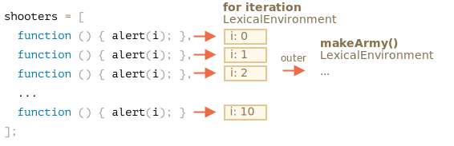

Să examinăm ce se întâmplă mai exact în `makeArmy`, iar soluția va deveni evidentă.

1. Creează o matrice goală `shooters`:

    ```js
    let shooters = [];
    ```
2. O umple cu funcții prin `shooters.push(function)` în buclă.

    Fiecare element este o funcție, astfel încât matricea rezultată arată astfel:

    ```js no-beautify
    shooters = [
      function () { alert(i); },
      function () { alert(i); },
      function () { alert(i); },
      function () { alert(i); },
      function () { alert(i); },
      function () { alert(i); },
      function () { alert(i); },
      function () { alert(i); },
      function () { alert(i); },
      function () { alert(i); }
    ];
    ```

3. Matricea este returnată din funcție.
    
    Apoi, mai târziu, apelarea oricărui membru, e.g. `army[5]()` va obține elementul `army[5]` din matrice (care este o funcție) și îl apelează.
    
    Acum de ce toate aceste funcții arată aceeași valoare, `10`?
    
    Asta pentru că nu există o variabilă locală `i` în interiorul funcțiilor `shooter`. Atunci când o astfel de funcție este apelată, aceasta preia `i` din mediul său lexical exterior.
    
    Atunci, care va fi valoarea lui `i`?
    
    Dacă ne uităm la sursă:
    
    ```js
    function makeArmy() {
      ...
      let i = 0;
      while (i < 10) {
        let shooter = function() { // funcția shooter
          alert( i ); // ar trebui să arate numărul său
        };
        shooters.push(shooter); // adaugă funcția la matrice
        i++;
      }
      ...
    }
    ```
    
    Putem vedea că toate funcțiile `shooter` sunt create în mediul lexical al funcției `makeArmy()`. Dar când este apelată `army[5]()`, `makeArmy` și-a terminat deja treaba, iar valoarea finală a lui `i` este `10` (`while` se oprește la `i=10`).
    
   Ca și rezultat, toate funcțiile `shooter` obțin aceeași valoare din mediul lexical extern și anume, ultima valoare, `i=10`.
    
    
    
    După cum puteți vedea mai sus, la fiecare iterație a unui bloc `while {...}`, un nou mediu lexical este creat. Așadar, pentru a remedia acest lucru, putem copia valoarea lui `i` într-o variabilă în cadrul blocului `while {...}`, astfel:
    
    ```js run
    function makeArmy() {
      let shooters = [];
    
      let i = 0;
      while (i < 10) {
        *!*
          let j = i;
        */!*
          let shooter = function() { // funcția shooter
            alert( *!*j*/!* ); // ar trebui să arate numărul său
          };
        shooters.push(shooter);
        i++;
      }
    
      return shooters;
    }
    
    let army = makeArmy();
    
    // Acum codul funcționează corect
    army[0](); // 0
    army[5](); // 5
    ```
    
    Aici `let j = i` declară o variabilă `j` "de iterație locală" și copiază `i` în ea. Primitivele sunt copiate "după valoare", astfel încât obținem de fapt o copie independentă a lui `i`, aparținând iterației curente a buclei.
    
    Shooters funcționează corect, deoarece valoarea lui `i` trăiește acum un pic mai aproape. Nu în mediul lexical `makeArmy()`, ci în Mediul Lexical care corespunde iterației buclei curente:
    
    
    
    O astfel de problemă ar putea fi evitată și dacă am folosi `for` la început, astfel:
    
    ```js run demo
    function makeArmy() {
    
      let shooters = [];
    
    *!*
      for(let i = 0; i < 10; i++) {
    */!*
        let shooter = function() { // funcția shooter
          alert( i ); // ar trebui să arate numărul său
        };
        shooters.push(shooter);
      }
    
      return shooters;
    }
    
    let army = makeArmy();
    
    army[0](); // 0
    army[5](); // 5
    ```
    
    În esență, este același lucru, deoarece `for` generează la fiecare iterație un nou mediu lexical, cu propria sa variabilă `i`. Astfel, `shooter` generat în fiecare iterație face referire la propriul `i`, chiar din acea iterație.
    
    

Acum, având în vedere că ați depus atât de mult efort pentru a citi acest lucru, iar rețeta finală este atât de simplă - folosiți doar `for`, vă puteți întreba -- s-a meritat?

Ei bine, dacă ați putea răspunde cu ușurință la această întrebare, nu ați citi soluția. Așadar, sperăm că această sarcină să vă fi ajutat să înțelegeți un pic mai bine lucrurile. 

În rest, există într-adevăr cazuri în care se preferă `while` în locul lui `for`, precum și alte scenarii, în care astfel de probleme sunt reale.S

