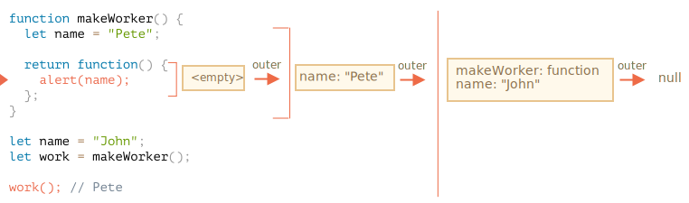

Răspunsul este: **Pete**.

Funcția `work()` din codul de mai jos obține `name` din locul de origine prin intermediul referinței mediului lexical extern:

Așadar, rezultatul este `"Pete"` aici.

Dar dacă nu ar exista `let name` în `makeWorker()`, atunci căutarea ar merge în exterior și ar lua variabila globală, așa cum putem vedea din lanțul de mai sus. În acest caz, rezultatul ar fi `"John"`.
