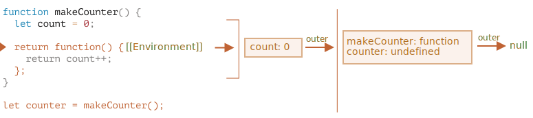

# Sfera variabilei, closure

JavaScript este un limbaj foarte orientat spre funcții. Acesta ne oferă o mare libertate. O funcție poate fi creată în orice moment, transmisă ca argument unei alte funcții, și ulterior apelată dintr-un cu totul alt loc din cod.

Știm deja că o funcție poate accesa variabile din afara ei (variabile "exterioare").

Dar ce se întâmplă dacă variabilele exterioare se schimbă de la crearea unei funcții? Va primi funcția valorile mai noi sau pe cele vechi?

Și dacă o funcție este transmisă ca argument și apelată dintr-un alt loc din cod, va avea acces la variabilele exterioare din noul loc?

Haideți să ne extindem cunoștințele pentru a înțelege aceste scenarii și altele mai complexe.

```smart header="Vom vorbi despre variabilele `let/const` aici"
În JavaScript, există 3 moduri de a declara o variabilă: `let`, `const` (cele moderne) și `var` (rămășița trecutului).

- În acest articol vom folosi variabilele `let` în exemple.
- Variabilele, declarate cu `const`, se comportă la fel, așa că acest articol se referă și la `const`.
- Vechiul `var` are câteva diferențe notabile, acestea vor fi acoperite în articolul <info:var>.
```

## Blocuri de cod

Dacă o variabilă este declarată în interiorul unui bloc de cod `{...}`, ea este vizibilă doar în interiorul acelui bloc.

De exemplu:

```js run
{
  // face o treabă cu variabile locale care nu ar trebui să fie văzute în exterior

  let message = "Bună ziua"; // vizibil doar în acest bloc

  alert(message); // Bună ziua
}

alert(message); // Error: message is not defined
```

Putem folosi acest lucru pentru a izola o bucată de cod care își face propria sarcină, cu variabile care îi aparțin doar ei:

```js run
{
  // afișează mesajul
  let message = "Bună ziua";
  alert(message);
}

{
  // afișează un alt mesaj
  let message = "La revedere";
  alert(message);
}
```

````smart header="Ar exista o eroare fără blocuri"
Vă rugăm să notați că, fără blocuri separate ar exista o eroare, dacă am folosi `let` cu numele variabilei existente:

```js run
// arată mesajul
let message = "Bună ziua";
alert(message);

// arată un alt mesaj
*!*
let message = "La revedere"; // Error: variable already declared
*/!*
alert(message);
```
````

Pentru `if`, `for`, `while` și așa mai departe, variabilele declarate în `{...}` sunt de asemenea vizibile doar în interior:

```js run
if (true) {
  let phrase = "Bună ziua!";

  alert(phrase); // Bună ziua!
}

alert(phrase); // Error, no such variable!
```

Aici, după ce `if` se termină, `alert` de mai jos nu va vedea `phrase`, de unde și eroarea.

Asta este grozav, deoarece ne permite să creăm variabile locale de bloc, specifice unei ramuri `if`.

Același lucru este valabil și pentru buclele `for` și `while`:

```js run
for (let i = 0; i < 3; i++) {
  // variabila i este vizibilă doar în interiorul acestui for
  alert(i); // 0, apoi 1, apoi 2
}

alert(i); // Eroare, nu există o astfel de variabilă
```

Vizual, `let i` se află în afara lui `{...}`. Dar construcția `for` este specială aici: variabila, declarată în interiorul ei, este considerată parte a blocului.

## Funcții nested

O funcție este numită "nested" atunci când este creată în interiorul altei funcții.

Acest lucru este posibil cu ușurință în JavaScript.

Îl putem folosi pentru a ne organiza codul, astfel:

```js
function sayHiBye(firstName, lastName) {

  // funcție helper nested de utilizat mai jos
  function getFullName() {
    return firstName + " " + lastName;
  }

  alert( "Bună ziua, " + getFullName() );
  alert( "La revedere, " + getFullName() );

}
```

Aici funcția *nested* `getFullName()` este făcută pentru conveniență. Aceasta poate accesa variabilele exterioare și astfel poate returna numele complet. Funcțiile nested sunt destul de frecvente în JavaScript.

Ceea ce este mult mai interesant, o funcție nested poate fi returnată: fie ca o proprietate a unui nou obiect ori ca un rezultat de sine stătător. Acesta poate fi apoi utilizat în altă parte. Indiferent unde, aceasta are în continuare acces la aceleași variabile exterioare.

Mai jos, `makeCounter` creează funcția "counter" care returnează următorul număr la fiecare invocare:

```js run
function makeCounter() {
  let count = 0;

  return function() {
    return count++;
  };
}

let counter = makeCounter();

alert( counter() ); // 0
alert( counter() ); // 1
alert( counter() ); // 2
```

În ciuda faptului că sunt simple, variantele ușor modificate ale acestui cod au utilizări practice, de exemplu, ca [generator de numere aleatoare](https://en.wikipedia.org/wiki/Pseudorandom_number_generator) pentru a genera valori aleatoare pentru testele automate.

Cum funcționează acest lucru? Dacă vom crea mai multe counters, vor fi ele independente? Ce se întâmplă cu variabilele aici?

Înțelegerea unor astfel de lucruri este excelentă pentru cunoștințele generale despre JavaScript și benefică pentru scenarii mai complexe. Așadar haideți să aprofundăm puțin.

## Mediu Lexical

```warn header="Aici sunt dragoni!"
Explicația tehnică aprofundată se găsește în cele ce urmează.

În măsura în care aș dori să evit detaliile low-level ale limbajului, orice înțelegere fără ele ar fi insuficientă și incompletă, așa că pregătiți-vă.
```

Pentru claritate, explicația este împărțită în mai mulți pași.

### Pasul 1. Variabile

În JavaScript, fiecare funcție care rulează, blocul de cod `{...}`, și scriptul ca întreg au un obiect intern (ascuns) asociat, cunoscut sub numele de *Mediu Lexical*.

Obiectul Lexical Environment este constituit din două părți:

1. *Environment Record* -- un obiect care stochează toate variabilele locale ca proprietăți ale acestuia (și alte informații, cum ar fi valoarea lui `this`).
2. O referință la *mediul lexical extern*, cel asociat cu codul extern.

**O "variabilă" este doar o proprietate a obiectului intern special, `Environment Record`. "A obține sau a modifica o variabilă" înseamnă "a obține sau a modifica o proprietate a acelui obiect".**

În acest cod simplu fără funcții, există un singur Mediu Lexical:


Acesta este așa-numitul Mediu Lexical *global*, asociat cu întregul script.

În imaginea de mai sus, dreptunghiul reprezintă Environment Record (stocare de variabile) iar săgeata reprezintă referința exterioară. Mediul Lexical global nu are o referință externă, de aceea săgeata indică `null`.

Pe măsură ce codul începe să se execute și continuă, Mediul Lexical se modifică.

Iată un cod puțin mai lung:


Dreptunghiurile din partea dreaptă demonstrează cum se modifică Mediul Lexical global în timpul execuției:

1. La pornirea scriptului, Mediul Lexical este prepopulat cu toate variabilele declarate.
    - Inițial, acestea se află în starea "Uninitialized". Aceasta este o stare internă specială, ceea ce înseamnă că motorul știe despre variabilă, dar nu poate fi referențiată până când nu este declarată cu `let`. Este aproape la fel ca și cum variabila nu ar exista.
2. Apoi apare definiția `let phrase`. Nu există încă o atribuire, deci valoarea ei este `undefined`. Putem folosi variabila din acest punct încolo.
3. Lui `phrase` i se atribuie o valoare.
4. `phrase` își schimbă valoarea.

Totul pare simplu deocamdată, nu?

- O variabilă este o proprietate a unui obiect intern special, asociată blocului/funcției/scriptului în curs de execuție.
- Lucrul cu variabilele înseamnă de fapt lucrul cu proprietățile acelui obiect.

```smart header="Mediul Lexical este un obiect din specificație"
"Mediul Lexical" este un obiect din specificație: el există doar "teoretic" în [specificația limbajului](https://tc39.es/ecma262/#sec-lexical-environments) pentru a descrie modul în care funcționează lucrurile. Nu putem obține acest obiect în codul nostru și să-l manipulăm direct.

De asemenea motoarele JavaScript îl pot optimiza, pot renunța la variabilele nefolosite pentru a economisi memorie și pot efectua alte trucuri interne, atâta timp cât comportamentul vizibil rămâne cel descris.
```

### Pasul 2. Function Declaration

O funcție este de asemenea o valoare, la fel ca o variabilă.

**Diferența este că o Function Declaration este instantaneu complet inițializată.**

Atunci când este creat un Mediu Lexical, o Function Declaration devine imediat o funcție gata de utilizare (spre deosebire de `let`, care este inutilizabilă până la declarație).

De aceea putem utiliza o funcție, declarată ca Function Declaration, chiar înainte de declarația propriu-zisă.

De exemplu, iată care este starea inițială a mediului lexical global atunci când adăugăm o funcție:


Firește, acest comportament se aplică numai la Function Declaration, nu și la Function Expression în care atribuim o funcție unei variabile, cum ar fi `let say = function(name)...`.

### Pasul 3. Mediul Lexical interior și exterior

Atunci când rulează o funcție, la începutul apelului, se creează automat un nou mediu lexical pentru a stoca variabilele locale și parametrii apelului.

De exemplu, pentru `say("John")`, acesta arată astfel (execuția se află la linia marcată cu o săgeată):

<!--
    ```js
    let phrase = "Bună ziua";

    function say(name) {
     alert( `${phrase}, ${name}` );
    }

    say("John"); // Bună ziua, John
    ```-->


În timpul apelului funcției avem două medii lexicale: cel intern (pentru apelul funcției) și cel extern (global):

- Mediul Lexical intern corespunde execuției curente a lui `say`. Acesta are o singură proprietate: `name`, argumentul funcției. Am apelat `say("John")`, deci valoarea lui `name` este `"John"`.
- Mediul Lexical exterior este Mediul Lexical global. Acesta conține variabila `phrase` și funcția în sine.

Mediul Lexical intern are o referință la cel `extern`.

**Când codul vrea să acceseze o variabilă -- se caută mai întâi Mediul Lexical interior, apoi cel exterior, apoi cel mai exterior și așa mai departe până la cel global.**

Dacă o variabilă nu este găsită nicăieri, este o eroare în modul strict (fără `use strict`, o atribuire la o variabilă inexistentă creează o nouă variabilă globală, pentru compatibilitate cu codul vechi).

În acest exemplu căutarea se desfășoară după cum urmează:

- Pentru variabila `name`, `alert` din `say` o găsește imediat în Mediul Lexical intern.
- Când vrea să acceseze `phrase`, atunci nu există `phrase` la nivel local, așa că urmărește referința la Mediul Lexical exterior și o găsește acolo.


### Step 4. Returning a function

Let's return to the `makeCounter` example.

```js
function makeCounter() {
  let count = 0;

  return function() {
    return count++;
  };
}

let counter = makeCounter();
```

At the beginning of each `makeCounter()` call, a new Lexical Environment object is created, to store variables for this `makeCounter` run.

So we have two nested Lexical Environments, just like in the example above:


What's different is that, during the execution of `makeCounter()`, a tiny nested function is created of only one line: `return count++`. We don't run it yet, only create.

All functions remember the Lexical Environment in which they were made. Technically, there's no magic here: all functions have the hidden property named `[[Environment]]`, that keeps the reference to the Lexical Environment where the function was created:



So, `counter.[[Environment]]` has the reference to `{count: 0}` Lexical Environment. That's how the function remembers where it was created, no matter where it's called. The `[[Environment]]` reference is set once and forever at function creation time.

Later, when `counter()` is called, a new Lexical Environment is created for the call, and its outer Lexical Environment reference is taken from `counter.[[Environment]]`:


Now when the code inside `counter()` looks for `count` variable, it first searches its own Lexical Environment (empty, as there are no local variables there), then the Lexical Environment of the outer `makeCounter()` call, where it finds and changes it.

**A variable is updated in the Lexical Environment where it lives.**

Here's the state after the execution:


If we call `counter()` multiple times, the `count` variable will be increased to `2`, `3` and so on, at the same place.

```smart header="Closure"
There is a general programming term "closure", that developers generally should know.

A [closure](https://en.wikipedia.org/wiki/Closure_(computer_programming)) is a function that remembers its outer variables and can access them. In some languages, that's not possible, or a function should be written in a special way to make it happen. But as explained above, in JavaScript, all functions are naturally closures (there is only one exception, to be covered in <info:new-function>).

That is: they automatically remember where they were created using a hidden `[[Environment]]` property, and then their code can access outer variables.

When on an interview, a frontend developer gets a question about "what's a closure?", a valid answer would be a definition of the closure and an explanation that all functions in JavaScript are closures, and maybe a few more words about technical details: the `[[Environment]]` property and how Lexical Environments work.
```

## Garbage collection

Usually, a Lexical Environment is removed from memory with all the variables after the function call finishes. That's because there are no references to it. As any JavaScript object, it's only kept in memory while it's reachable.

However, if there's a nested function that is still reachable after the end of a function, then it has `[[Environment]]` property that references the lexical environment.

In that case the Lexical Environment is still reachable even after the completion of the function, so it stays alive.

For example:

```js
function f() {
  let value = 123;

  return function() {
    alert(value);
  }
}

let g = f(); // g.[[Environment]] stores a reference to the Lexical Environment
// of the corresponding f() call
```

Please note that if `f()` is called many times, and resulting functions are saved, then all corresponding Lexical Environment objects will also be retained in memory. In the code below, all 3 of them:

```js
function f() {
  let value = Math.random();

  return function() { alert(value); };
}

// 3 functions in array, every one of them links to Lexical Environment
// from the corresponding f() run
let arr = [f(), f(), f()];
```

A Lexical Environment object dies when it becomes unreachable (just like any other object). In other words, it exists only while there's at least one nested function referencing it.

In the code below, after the nested function is removed, its enclosing Lexical Environment (and hence the `value`) is cleaned from memory:

```js
function f() {
  let value = 123;

  return function() {
    alert(value);
  }
}

let g = f(); // while g function exists, the value stays in memory

g = null; // ...and now the memory is cleaned up
```

### Real-life optimizations

As we've seen, in theory while a function is alive, all outer variables are also retained.

But in practice, JavaScript engines try to optimize that. They analyze variable usage and if it's obvious from the code that an outer variable is not used -- it is removed.

**An important side effect in V8 (Chrome, Edge, Opera) is that such variable will become unavailable in debugging.**

Try running the example below in Chrome with the Developer Tools open.

When it pauses, in the console type `alert(value)`.

```js run
function f() {
  let value = Math.random();

  function g() {
    debugger; // in console: type alert(value); No such variable!
  }

  return g;
}

let g = f();
g();
```

As you could see -- there is no such variable! In theory, it should be accessible, but the engine optimized it out.

That may lead to funny (if not such time-consuming) debugging issues. One of them -- we can see a same-named outer variable instead of the expected one:

```js run global
let value = "Surprise!";

function f() {
  let value = "the closest value";

  function g() {
    debugger; // in console: type alert(value); Surprise!
  }

  return g;
}

let g = f();
g();
```

This feature of V8 is good to know. If you are debugging with Chrome/Edge/Opera, sooner or later you will meet it.

That is not a bug in the debugger, but rather a special feature of V8. Perhaps it will be changed sometime. You can always check for it by running the examples on this page.
