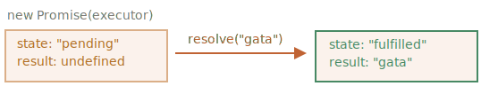

# Promisiune

Imaginează-ți că ești un cântăreț de top, iar fanii îți cer zi și noapte următorul cântec.

Pentru a fi ușurat, le promiți că le vei trimite cântecul atunci când va fi publicat. Le dai fanilor tăi o listă. Aceștia își pot completa adresele de e-mail, astfel încât atunci când cântecul devine disponibil, toți cei înscriși îl primesc instantaneu. Și chiar dacă ceva merge foarte prost, să zicem, un incendiu în studio, astfel încât să nu puteți publica melodia, ei vor fi înștiințați.

Toată lumea este fericită: tu, pentru că oamenii nu te mai aglomerează, și fanii, pentru că nu vor pierde melodia.

Aceasta este o analogie din viața reală pentru lucrurile pe care le avem adesea în programare:

1. Un "cod producător" care face ceva și care durează. De exemplu, ceva cod care încarcă datele într-o rețea. Acesta este un "cântăreț".
2. Un "cod consumător" care vrea rezultatul "codului producător" odată ce este gata. Multe funcții pot avea nevoie de acel rezultat. Aceștia sunt "fanii".
3. O *promisiune* este un obiect JavaScript special care face legătura între "codul producător" și "codul consumator". În termenii analogiei noastre: aceasta este "lista de abonamente". "Codul producător" își ia tot timpul necesar pentru a produce rezultatul promis, iar "promisiunea" pune acel rezultat la dispoziția tuturor codurilor abonate atunci când este gata.

Analogia nu este teribil de exactă, deoarece promisiunile JavaScript sunt mai complexe decât o simplă listă de abonamente: au caracteristici și limitări suplimentare. Dar este bună pentru început.

Sintaxa constructorului pentru un obiect promisiune este:

```js
let promise = new Promise(function(resolve, reject) {
  // executor (codul producător, "cântăreț")
});
```

Funcția transmisă la `new Promise` se numește *executor*. Atunci când `new Promise` este creat, executorul rulează automat. Acesta conține codul producător care ar trebui să producă în cele din urmă rezultatul. În termenii analogiei de mai sus: executorul este "cântărețul".

Argumentele sale `resolve` și `reject` sunt callback-uri furnizate de JavaScript însuși. Codul nostru se află doar în interiorul executorului.

Atunci când executorul obține rezultatul, fie că este devreme sau târziu, nu contează, ar trebui să apeleze unul dintre aceste callback-uri:

- `resolve(value)` — în cazul în care lucrarea este terminată cu succes, cu rezultatul `value`.
- `reject(error)` — dacă s-a produs o eroare, `error` este obiectul de eroare.

Deci, ca să rezumăm: executorul rulează automat și încearcă să îndeplinească o sarcină. Când termină încercarea, apelează `resolve` dacă a avut succes sau `reject` dacă a existat o eroare.

Obiectul `promise` returnat de constructorul `new Promise` are următoarele proprietăți interne:

- `state` — inițial `"pending"`, apoi se schimbă fie în `"fulfilled"` când este apelat `resolve` ori în `"rejected"` când este apelat `reject`.
- `result` — inițial `undefined`, apoi se modifică în `value` atunci când se apelează `resolve(value)` ori `error` atunci când se apelează `reject(error)`.

Deci, executorul mută în cele din urmă `promise` într-una din aceste stări:


Mai târziu vom vedea cum "fanii" se pot abona la aceste modificări.

Iată un exemplu de constructor de promisiuni și o funcție executor simplă cu "cod de producție" care necesită timp (prin `setTimeout`):

```js run
let promise = new Promise(function(resolve, reject) {
  // funcția rulează automat atunci când promisiunea este construită

  // după 1 secundă se semnalează că treaba este gata cu rezultatul "gata"
  setTimeout(() => *!*resolve("gata")*/!*, 1000);
});
```

Putem observa două lucruri prin rularea codului de mai sus:

1. Executorul este apelat automat și imediat (de către `new Promise`).
2. Executorul primește două argumente: `resolve` și `reject`. Aceste funcții sunt predefinite de motorul JavaScript, deci nu trebuie să le creăm. Ar trebui să apelăm doar una dintre ele atunci când suntem gata.

    După o secundă de "procesare", executorul apelează `resolve("gata")` pentru a produce rezultatul. Acest lucru schimbă starea obiectului `promise`:

    

Acesta a fost un exemplu de finalizare cu succes a unei sarcini, o "promisiune îndeplinită".

Și acum un exemplu de executor care respinge promisiunea cu o eroare:

```js
let promise = new Promise(function(resolve, reject) {
  // după 1 secundă semnalează că sarcina s-a terminat cu o eroare
  setTimeout(() => *!*reject(new Error("Uuups!"))*/!*, 1000);
});
```

Apelul la `reject(...)` mută obiectul promisiune în starea `"rejected"`:


Pe scurt, executorul ar trebui să execute o sarcină (de obicei, ceva care necesită timp) și apoi să apeleze `resolve` sau `reject` pentru a schimba starea obiectului promisiune corespunzător.

O promisiune care este rezolvată ori respinsă se numește "soluționată", spre deosebire de o promisiune inițial "în așteptare".

````smart header="Nu poate exista decât un singur rezultat sau o eroare"
Executorul ar trebui să apeleze doar un singur `resolve` sau un singur `reject`. Orice schimbare de stare este definitivă.

Toate apelurile ulterioare de `resolve` și `reject` sunt ignorate:

```js
let promise = new Promise(function(resolve, reject) {
*!*
  resolve("gata");
*/!*

  reject(new Error("…")); // ignorat
  setTimeout((() => resolve("…")); // ignorat
});
```

Ideea este că o sarcină efectuată de executor poate avea un singur rezultat sau o eroare.

De asemenea, `resolve`/`reject` așteaptă un singur argument (sau niciunul) și va ignora argumentele suplimentare.
````

```smart header="Respinge cu obiecte `Error`"
În cazul în care ceva merge prost, executorul ar trebui să apeleze `reject`. Acest lucru se poate face cu orice tip de argument (la fel ca `resolve`). Dar se recomandă utilizarea obiectelor `Error` (sau a obiectelor care moștenesc din `Error`). Raționamentul pentru aceasta va deveni în curând evident.
```

````smart header="Apelarea imediată a `resolve`/`reject`"
În practică, un executor face de obicei ceva în mod asincron și apelează `resolve`/`reject` după un anumit timp, dar nu trebuie să o facă. De asemenea, putem apela `resolve` sau `reject` imediat, astfel:

```js
let promise = new Promise(function(resolve, reject) {
  // fără a ne lua timpul necesar pentru a face treaba
  resolve(123); // să dea imediat rezultatul: 123
});
```

De exemplu, acest lucru s-ar putea întâmpla când începem să facem o sarcină dar apoi vedem că totul a fost deja finalizat și pus în cache.

Asta este în regulă. Avem imediat o promisiune rezolvată.
````

```smart header="The `state` și `result` sunt interne"
Proprietățile `state` și `result` ale obiectului Promise sunt interne. Nu le putem accesa direct. Pentru aceasta putem folosi metodele `.then`/`.catch`/`.finally`. Acestea sunt descrise mai jos.
```

## Consumatori: then, catch

Un obiect Promise servește ca o legătură între executor (codul producător ori "cântărețul") și funcțiile consumatoare (fanii), care vor primi rezultatul ori eroarea. Funcțiile consumatoare pot fi înregistrate (abonate) cu ajutorul metodelor `.then` și `.catch`.

### then

Cea mai importantă, fundamentală din ele este `.then`.

Sintaxa este:

```js
promise.then(
  function(result) { *!*/* gestionează un rezultat de succes */*/!* },
  function(error) { *!*/* gestionează o eroare */*/!* }
);
```

Primul argument din `.then` este o funcție care rulează atunci când promisiunea este rezolvată și primește rezultatul.

Al doilea argument al lui `.then` este o funcție care rulează atunci când promisiunea este respinsă și primește eroarea.

De exemplu, iată o reacție la o promisiune rezolvată cu succes:

```js run
let promise = new Promise(function(resolve, reject) {
  setTimeout(() => resolve("gata!")), 1000);
});

// resolve rulează prima funcție din .then
promise.then(
*!*
  result => alert(result), // afișează "gata!" după 1 secundă
*/!*
  error => alert(error) // nu rulează
);
```

Prima funcție a fost executată.

Iar în cazul unei respingeri, a doua:

```js run
let promise = new Promise(function(resolve, reject) {
  setTimeout(() => reject(new Error("Uuups!"))), 1000);
});

// reject rulează a doua funcție din .then
promise.then(
  result => alert(result), // nu rulează
*!*
  error => alert(error) // afișează "Error: Uuups!" după 1 secundă
*/!*
);
```

Dacă suntem interesați doar de completările cu succes, atunci putem furniza un singur argument de funcție pentru `.then`:

```js run
let promise = new Promise(resolve => {
  setTimeout(() => resolve("gata!")), 1000);
});

*!*
promise.then(alert); // arată "gata!" după 1 secundă
*/!*
```

### catch

Dacă suntem interesați doar de erori, atunci putem folosi `null` ca prim argument: `.then(null, errorHandlingFunction)`. Sau putem folosi `.catch(errorHandlingFunction)`, care este exact același lucru:


```js run
let promise = new Promise((resolve, reject) => { {
  setTimeout(() => reject(new Error("Uuups!!"))), 1000);
});

*!*
// .catch(f) este același lucru cu promise.then(null, f)
promise.catch(alert); // afișează "Error: Uuups!" după 1 secundă
*/!*
```

Apelul `.catch(f)` este un analog complet al lui `.then(null, f)`, este doar o prescurtare.

## Curățare: finally

La fel cum există o clauză `finally` într-un obișnuit `try {...} catch {...}`, există `finally` în promisiuni.

Apelul `.finally(f)` este similar cu `.then(f, f)` în sensul că `f` rulează întotdeauna, atunci când promisiunea este soluționată: fie că este rezolvată sau respinsă.

Ideea lui `finally` este de a stabili un gestionar pentru a efectua curățarea/finalizarea după ce operațiunile anterioare sunt finalizate.

E.g. oprirea încărcării indicatorilor, închiderea conexiunilor care nu mai sunt necesare, etc.

Gândiți-vă la el ca la un încheietor de petrecere. Indiferent dacă a fost o petrecere bună sau rea, câți prieteni au fost la ea, tot trebuie (sau cel puțin ar trebui) să facem o curățare după ea.

Codul poate arăta astfel:

```js
new Promise((resolve, reject) => {
  /* face ceva care necesită timp, și apoi apelează resolve sau poate reject */
})
*!*
  // rulează atunci când promisiunea este soluționată, nu contează dacă a fost cu succes sau nu
  .finally(() => oprește indicatorul de încărcare)
  // astfel încât indicatorul de încărcare să fie întotdeauna oprit înainte de a continua
*/!*
  .then(result => afișează rezultatul, err => afișează eroarea)
```

Vă rugăm să rețineți că `finally(f)` nu este chiar un alias al lui `then(f,f)`.

Există diferențe importante:

1. Un procesor `finally` nu are argumente. În `finally` nu știm dacă promisiunea are succes sau nu. Acest lucru este în regulă, deoarece sarcina noastră este de obicei de a efectua proceduri de finalizare "generale".

    Vă rugăm să vă uitați la exemplul de mai sus: după cum puteți vedea, gestionarul `finally` nu are argumente, iar rezultatul promisiunii este gestionat de gestionarul următor.
2. Un gestionar `finally` "trece" rezultatul sau eroarea către următorul gestionar adecvat.

    De exemplu, aici rezultatul este trecut prin `finally` către `then`:

    ```js run
    new Promise((resolve, reject) => {
      setTimeout(() => resolve("value")), 2000);
    })
      .finally(() => alert("Promise ready"))) // se declanșează primul
      .then(result => alert(rezultat)); // <-- .then arată "value"
    ```

    După cum puteți vedea, `value` returnată de prima promisiune este trecută prin `finally` către următorul `then`.

    Acest lucru este foarte convenabil, deoarece `finally` nu este menit să proceseze rezultatul unei promisiuni. Așa cum s-a spus, este un loc pentru a face curățare generică, indiferent de rezultatul obținut.

    Și iată un exemplu de eroare, ca să vedem cum este trecută prin `finally` către `catch`:

    ```js run
    new Promise((resolve, reject) => {
      throw new Error("eroare");
    })
      .finally(() => alert("Promisiune gata"))) // se declanșează mai înțâi
      .catch(err => alert(err)); // <-- .catch arată eroarea
    ```

3. Un gestionar `finally` deasemeni nu ar trebui să returneze nimic. Dacă o face, valoarea returnată este ignorată în tăcere.

    Singura excepție de la această regulă este atunci când un gestionar `finally` aruncă o eroare. Atunci această eroare trece la următorul gestionar, în locul oricărui rezultat anterior.

Pentru a rezuma:

- Un gestionar `finally` nu primește rezultatul gestionarului anterior (nu are argumente). Acest deznodământ este în schimb trecut prin el, la următorul gestionar adecvat.
- Dacă un gestionar `finally` returnează ceva, acesta este ignorat.
- Când `finally` aruncă o eroare, atunci execuția trece la cel mai apropiat gestionar de erori.

Aceste caracteristici sunt utile și fac lucrurile să funcționeze în mod corect dacă folosim `finally` așa cum ar trebui să fie folosit: pentru proceduri de curățare generice.

````smart header="Putem atașa gestionari către promisiuni soluționate"
Dacă o promisiune este în așteptare, gestionarii `.then/catch/finally` așteaptă rezultatul acesteia.

Uneori, se poate întâmpla ca o promisiune să fie deja soluționată atunci când îi adăugăm un gestionar.

Într-un astfel de caz, acești gestionari rulează imediat:

```js run
// promisiunea devine soluționată imediat după creare
let promise = new Promise(resolve => resolve("gata!")));

promise.then(alert); // gata! (se afișează chiar acum)
```

Notați că acest lucru face ca promisiunile să fie mai puternice decât scenariul "listă de abonamente" din viața reală. Dacă cântărețul și-a lansat deja cântecul și apoi o persoană se înscrie pe lista de abonați, probabil că nu va primi acel cântec. Abonamentele în viața reală trebuie făcute înainte de eveniment.

Promisiunile sunt mai flexibile. Putem adăuga gestionari în orice moment: dacă rezultatul este deja acolo, acestea se execută pur și simplu.
````

## Exemplu: loadScript [#loadscript]

În continuare, să vedem mai multe exemple practice despre cum promisiunile ne pot ajuta să scriem cod asincron.

Avem funcția `loadScript` pentru încărcarea unui script din capitolul anterior.

Iată varianta bazată pe callback, doar pentru a ne reaminti de ea:

```js
function loadScript(src, callback) {
  let script = document.createElement('script');
  script.src = src;

  script.onload = () => callback(null, script);
  script.onerror = () => callback(new Error(`Eroare de încărcare a scriptului pentru ${src}`));

  document.head.append(script);
}
```

Haideți să-l rescriem folosind Promisiuni.

Noua funcție `loadScript` nu va avea nevoie de un callback. În schimb, ea va crea și va returna un obiect Promise care se va soluționa atunci când încărcarea este completă. Codul exterior îi poate adăuga gestionari (funcții de abonare) folosind `.then`:

```js run
function loadScript(src) {
  return new Promise(function(resolve, reject) {
    let script = document.createElement('script');
    script.src = src;

    script.onload = () => resolve(script);
    script.onerror = () => reject(new Error(`Eroare de încărcare a scriptului pentru ${src}`));

    document.head.append(script);
  });
}
```

Utilizare:

```js run
let promise = loadScript("https://cdnjs.cloudflare.com/ajax/libs/lodash.js/4.17.11/lodash.js");

promise.then(
  script => alert(`${script.src} este încărcat!`),
  error => alert(`Eroare: ${error.message}`)
);

promise.then(script => alert('Un alt gestionar...'));
```

Putem observa imediat câteva beneficii față de modelul bazat pe callback:


| Promisiuni | Callbacks |
|------------|-----------|
| Promisiunile ne permit să facem lucrurile în ordinea firească. Mai întâi, rulăm `loadScript(script)`, iar apoi `.then` scriem ce să facem cu rezultatul. | Trebuie să avem la dispoziție o funcție `callback` atunci când apelăm `loadScript(script, callback)`. Cu alte cuvinte, trebuie să știm ce să facem cu rezultatul *înainte* de a fi apelat `loadScript`. |
| Putem apela `.then` către o Promisiune de câte ori dorim. De fiecare dată, adăugăm un nou "fan", o nouă funcție de abonare, către "lista de abonamente". Mai multe despre asta în capitolul următor: [](info:promise-chaining). | Nu poate exista decât un singur callback. |

Așadar promisiunile ne oferă un flux de cod mai bun și mai multă flexibilitate. Dar mai este și altceva. Vom vedea asta în capitolele următoare.
