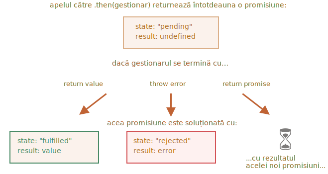

# Promisiuni înlănțuite

Să ne întoarcem la problema menționată în capitolul <info:callbacks>: avem o secvență de sarcini asincrone care trebuie efectuate una după alta - de exemplu, încărcarea scripturilor. Cum putem să o codăm bine?

Promisiunile oferă câteva rețete pentru a face asta.

În acest capitol acoperim înlănțuirea promisiunilor.

Arată așa:

```js run
new Promise(function(resolve, reject) {

  setTimeout(() => resolve(1), 1000); // (*)

}).then(function(result) { // (**)

  alert(result); // 1
  return result * 2;

}).then(function(result) { // (***)

  alert(result); // 2
  return result * 2;

}).then(function(result) {

  alert(result); // 4
  return result * 2;

});
```

Ideea este că rezultatul este transmis prin lanțul de gestionari `.then`.

Aici fluxul este următorul:
1. Promisiunea inițială se rezolvă în 1 secundă `(*)`,
2. Apoi gestionarul `.then` este apelat `(**)`, care la rândul său creează o nouă promisiune (rezolvată cu valoarea `2`).
3. Următorul `then` `(***)` primește rezultatul celui precedent, îl procesează (îl dublează) și îl trece la următorul gestionar.
4. ...și așa mai departe.

Pe măsură ce rezultatul este transmis de-a lungul lanțului de gestionari, putem vedea o secvență de apeluri `alert`: `1` -> `2` -> `4`.



Totul funcționează, deoarece fiecare apel la un `.then` returnează o nouă promisiune, astfel încât să putem apela următorul `.then` pe ea.

Atunci când un gestionar returnează o valoare, aceasta devine rezultatul acelei promisiuni, așa că următorul `.then` este apelat cu ea.

**O greșeală clasică de începător: tehnic putem deasemeni adăuga mai multe `.then` la o singură promisiune. Aceasta nu este o înlănțuire.**

De examplu:
```js run
let promise = new Promise(function(resolve, reject) {
  setTimeout(() => resolve(1), 1000);
});

promise.then(function(result) {
  alert(result); // 1
  return result * 2;
});

promise.then(function(result) {
  alert(result); // 1
  return result * 2;
});

promise.then(function(result) {
  alert(result); // 1
  return result * 2;
});
```

Ceea ce am făcut aici este doar mai mulți gestionari pentru o promisiune. Aceștia nu își transmit rezultatul unul altuia; în schimb îl procesează independent.

Iată imaginea (comparați-o cu înlănțuirea de mai sus):


Toate `.then` pe aceeași promisiune obțin același rezultat -- rezultatul acelei promisiuni. Deci în codul de mai sus toate `alert` arată același: `1`.

În practică avem rareori nevoie de multipli gestionari pentru o promisiune. Înlănțuirea este folosită mult mai des.

## Promisiuni care se întorc

Un gestionar, utilizat în `.then(gestionar)` poate crea și returna o promisiune.

În acest caz ceilalți gestionari așteaptă până când aceasta se soluționează, și apoi obțin rezultatul ei.

De exemplu:

```js run
new Promise(function(resolve, reject) {

  setTimeout(() => resolve(1), 1000);

}).then(function(result) {

  alert(result); // 1

*!*
  return new Promise((resolve, reject) => { // (*)
    setTimeout(() => resolve(result * 2), 1000);
  });
*/!*

}).then(function(result) { // (**)

  alert(result); // 2

  return new Promise((resolve, reject) => {
    setTimeout(() => resolve(result * 2), 1000);
  });

}).then(function(result) {

  alert(result); // 4

});
```

Aici primul `.then` arată `1` și returnează `new Promise(…)` în linia `(*)`. După o secundă se rezolvă, iar rezultatul (argumentul lui `resolve`, aici este `result * 2`) este transmis către gestionarul celui de-al doilea `.then`. Acel gestionar se află în linia `(**)`, arată `2` și face același lucru.

Deci rezultatul este același ca în exemplul anterior: 1 -> 2 -> 4, dar acum cu o întârziere de 1 secundă între apelurile `alert`.

Returnarea promisiunilor ne permite să construim lanțuri de acțiuni asincrone.

## Exemplu: loadScript

Să folosim această caracteristică cu promisiunile `loadScript`, definite în [capitolul anterior](info:promise-basics#loadscript), pentru a încărca scripturile unul câte unul, în succesiune:

```js run
loadScript("/article/promise-chaining/one.js")
  .then(function(script) {
    return loadScript("/article/promise-chaining/two.js");
  })
  .then(function(script) {
    return loadScript("/article/promise-chaining/three.js");
  })
  .then(function(script) {
    // utilizează funcțiile declarate în scripturi
    // pentru a arăta că acestea sunt într-adevăr încărcate
    one();
    two();
    three();
  });
```

Acest cod poate fi scurtat puțin cu ajutorul funcțiilor săgeată:

```js run
loadScript("/article/promise-chaining/one.js")
  .then(script => loadScript("/article/promise-chaining/two.js"))
  .then(script => loadScript("/article/promise-chaining/three.js"))
  .then(script => {
    // scripturile sunt încărcate, putem folosi funcțiile declarate acolo
    one();
    two();
    three();
  });
```


Aici fiecare apel `loadScript` returnează o promisiune, iar următorul `.then` rulează atunci când se soluționează. Apoi inițiază încărcarea următorului script. Așa că scripturile sunt încărcate unul după altul.

Putem adăuga mai multe acțiuni asincrone în lanț. Vă rugăm să rețineți că acest cod este încă "plat" - crește în jos, nu spre dreapta. Nu există semne de "piramida osândei".

Tehnic, am putea adăuga `.then` direct la fiecare `loadScript`, astfel:

```js run
loadScript("/article/promise-chaining/one.js").then(script1 => {
  loadScript("/article/promise-chaining/two.js").then(script2 => {
    loadScript("/article/promise-chaining/three.js").then(script3 => {
      // această funcție are acces la variabilele script1, script2 și script3
      one();
      two();
      three();
    });
  });
});
```

Acest cod face același lucru: încarcă 3 scripturi în succesiune. Dar "crește spre dreapta". Deci avem aceeași problemă ca și în cazul callback-urilor.

Oamenii care încep să folosească promisiuni uneori nu știu despre înlănțuire, așa că scriu în acest fel. În general, este preferabilă înlănțuirea.

Uneori este în regulă să scriem `.then` direct, deoarece funcția nested are acces la outer scope. În exemplul de mai sus cea mai nested funcție callback are acces la toate variabilele `script1`, `script2`, `script3`. Dar aceasta este mai degrabă o excepție decât o regulă.


````smart header="Thenables"
Pentru a fi mai precis, un gestionar poate returna nu chiar o promisiune, ci un așa-numit obiect "thenable" - un obiect arbitrar care are o metodă `.then`. Acesta va fi tratat în același mod ca o promisiune.

Ideea este că bibliotecile terțe pot implementa propriile obiecte "compatibile cu promisiunile". Acestea pot avea un set extins de metode, dar pot fi de asemenea compatibile cu promisiunile native, deoarece implementează `.then`.

Iată un exemplu de obiect thenable:

```js run
class Thenable {
  constructor(num) {
    this.num = num;
  }
  then(resolve, reject) {
    alert(resolve); // function() { cod nativ }
    // resolve cu this.num*2 după 1 secundă
    setTimeout(() => resolve(this.num * 2), 1000); // (**)
  }
}

new Promise(resolve => resolve(1))
  .then(result => {
*!*
    return new Thenable(result); // (*)
*/!*
  })
  .then(alert); // afișează 2 după 1000ms
```

JavaScript verifică obiectul returnat de gestionarul `.then` din linia `(*)`: dacă are o metodă apelabilă numită `then`, atunci apelează acea metodă oferind ca argumente funcțiile native `resolve`, `reject` (similar unui executor) și așteaptă până când una dintre ele este apelată. În exemplul de mai sus `resolve(2)` este apelat după 1 secundă `(**)`. Apoi rezultatul este transmis mai departe în lanț.

Această caracteristică ne permite să integrăm obiecte personalizate în lanțurile de promisiuni fără a fi nevoie să moștenim din `Promise`.
````


## Exemplu mai mare: fetch

În programarea frontend, promisiunile sunt adesea folosite pentru network requests. Să vedem deci un exemplu extins despre asta.

Vom folosi metoda [fetch](info:fetch) pentru a încărca informațiile despre utilizator de pe remote server. Aceasta are o mulțime de parametri opționali acoperiți în [capitole separate](info:fetch), dar sintaxa de bază este destul de simplă:

```js
let promise = fetch(url);
```

Aceasta face un network request către `url` și returnează o promisiune. Promisiunea se rezolvă cu un obiect `response` atunci când remote server răspunde cu anteturi, dar *înainte ca răspunsul complet să fie descărcat*.

Pentru a citi răspunsul complet, ar trebui să apelăm metoda `response.text()`: aceasta returnează o promisiune care se rezolvă atunci când textul complet este descărcat de pe remote server, cu acel text ca rezultat.

Codul de mai jos face o cerere către `user.json` și încarcă textul acestuia de pe server:

```js run
fetch('/article/promise-chaining/user.json')
  // .then de mai jos rulează când remote server răspunde
  .then(function(response) {
    // response.text() returnează o nouă promisiune care se rezolvă cu întregul response text
    // când se încarcă
    return response.text();
  })
  .then(function(text) {
    // ...și iată conținutul din remote file
    alert(text); // {"name": "iliakan", "isAdmin": true}
  });
```

Obiectul `response` returnat de `fetch` include de asemenea metoda `response.json()` care citește remote data și o parsează ca JSON. În cazul nostru asta este chiar mai convenabil, așa că să trecem la ea.

Vom folosi de asemenea funcții săgeată pentru a fi mai conciși:

```js run
// la fel ca mai sus, dar response.json() parsează remote content ca JSON
fetch('/article/promise-chaining/user.json')
  .then(response => response.json())
  .then(user => alert(user.name)); // iliakan, am primit numele utilizatorului
```

Acum să facem ceva cu utilizatorul încărcat.

De exemplu, putem face încă o cerere către GitHub, încărca profilul utilizatorului și afișa avatarul:

```js run
// Faceți o cerere pentru user.json
fetch('/article/promise-chaining/user.json')
  // Încarcă-l ca json
  .then(response => response.json())
  // Efectuați o cerere către GitHub
  .then(user => fetch(`https://api.github.com/users/${user.name}`))
  // Încarcă răspunsul ca json
  .then(response => response.json())
  // Afișează imaginea avatarului (githubUser.avatar_url) timp de 3 secunde (poate să o animăm)
  .then(githubUser => {
    let img = document.createElement('img');
    img.src = githubUser.avatar_url;
    img.className = "promise-avatar-example";
    document.body.append(img);

    setTimeout(() => img.remove(), 3000); // (*)
  });
```

Codul funcționează; vezi comentariile despre detalii. Cu toate acestea, există o potențială problemă în el, o eroare tipică pentru cei care încep să folosească promisiuni.

Uitați-vă la linia `(*)`: cum putem face ceva *după* ce avatarul a terminat de arătat și este îndepărtat? De exemplu, am dori să afișăm un formular pentru editarea acelui utilizator sau altceva. Deocamdată, nu există nicio modalitate.

Pentru a face lanțul extensibil, trebuie să returnăm o promisiune care să se rezolve atunci când avatarul termină să fie arătat.

Așa:

```js run
fetch('/article/promise-chaining/user.json')
  .then(response => response.json())
  .then(user => fetch(`https://api.github.com/users/${user.name}`))
  .then(response => response.json())
*!*
  .then(githubUser => new Promise(function(resolve, reject) { // (*)
*/!*
    let img = document.createElement('img');
    img.src = githubUser.avatar_url;
    img.className = "promise-avatar-example";
    document.body.append(img);

    setTimeout(() => {
      img.remove();
*!*
      resolve(githubUser); // (**)
*/!*
    }, 3000);
  }))
  // se declanșează după 3 secunde
  .then(githubUser => alert(`A terminat de arătat ${githubUser.name}`));
```

Adică, gestionarul `.then` din linia `(*)` acum returnează `new Promise`, care devine soluționată numai după apelul lui `resolve(githubUser)` în `setTimeout` `(**)`. Următorul `.then` din lanț va aștepta pentru aceasta.

Ca o bună practică, o acțiune asincronă ar trebui să returneze întotdeauna o promisiune. Asta face posibilă planificarea acțiunilor după ea; chiar dacă nu plănuim să extindem lanțul acum, s-ar putea să avem nevoie de el mai târziu.

În cele din urmă, putem împărți codul în funcții reutilizabile:

```js run
function loadJson(url) {
  return fetch(url)
    .then(response => response.json());
}

function loadGithubUser(name) {
  return loadJson(`https://api.github.com/users/${name}`);
}

function showAvatar(githubUser) {
  return new Promise(function(resolve, reject) {
    let img = document.createElement('img');
    img.src = githubUser.avatar_url;
    img.className = "promise-avatar-example";
    document.body.append(img);

    setTimeout(() => {
      img.remove();
      resolve(githubUser);
    }, 3000);
  });
}

// Utilizați-le:
loadJson('/article/promise-chaining/user.json')
  .then(user => loadGithubUser(user.name))
  .then(showAvatar)
  .then(githubUser => alert(`Finished showing ${githubUser.name}`));
  // ...
```

## Rezumat

Dacă un gestionar `.then` (sau `catch/finally`, nu contează) returnează o promisiune, restul lanțului așteaptă până când se soluționează. Atunci când se întâmplă, rezultatul (sau eroarea) este transmis mai departe.

Iată o imagine completă:


